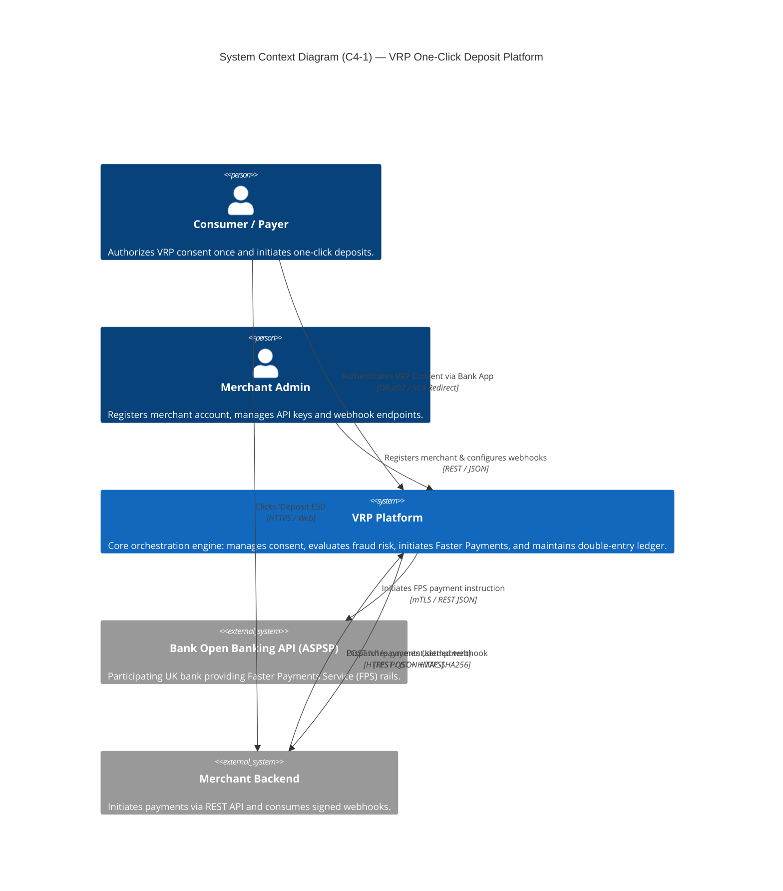
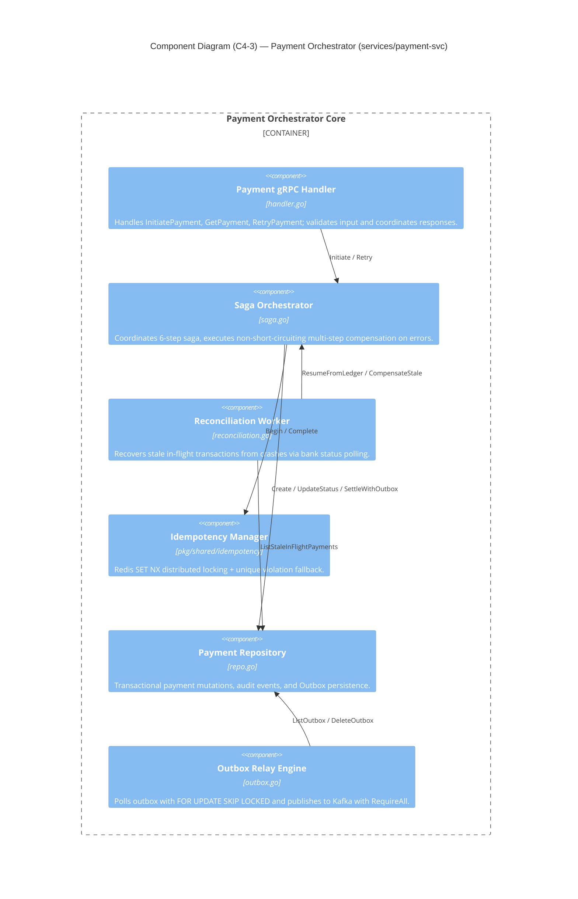
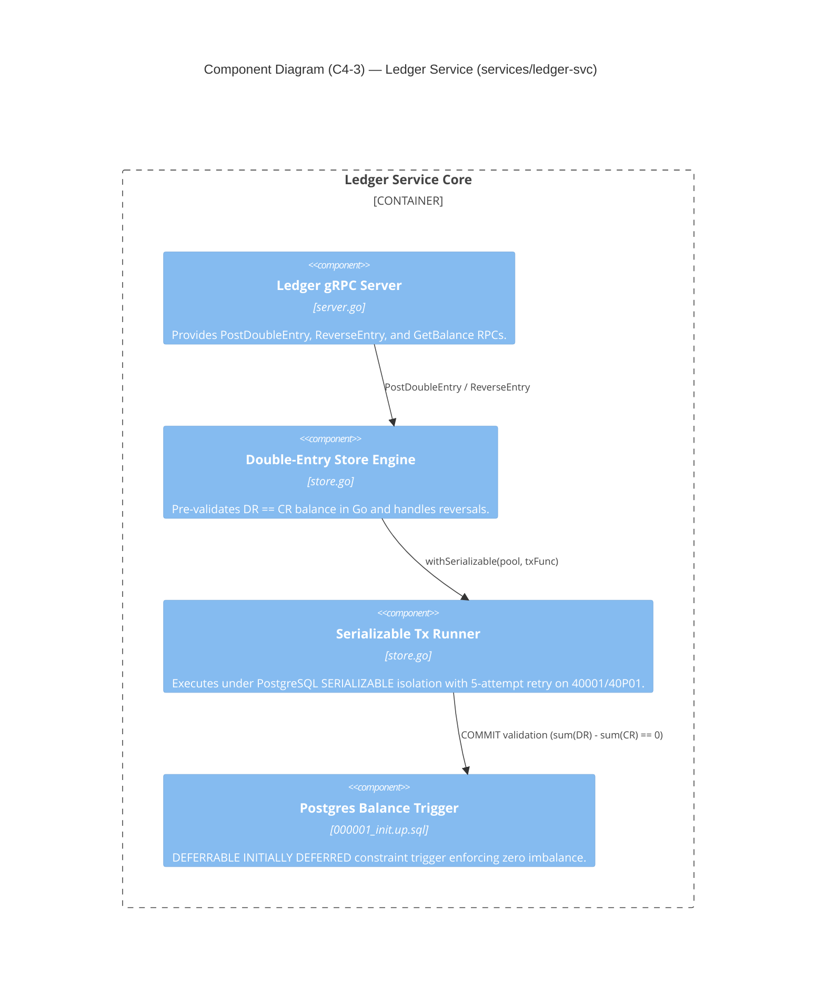
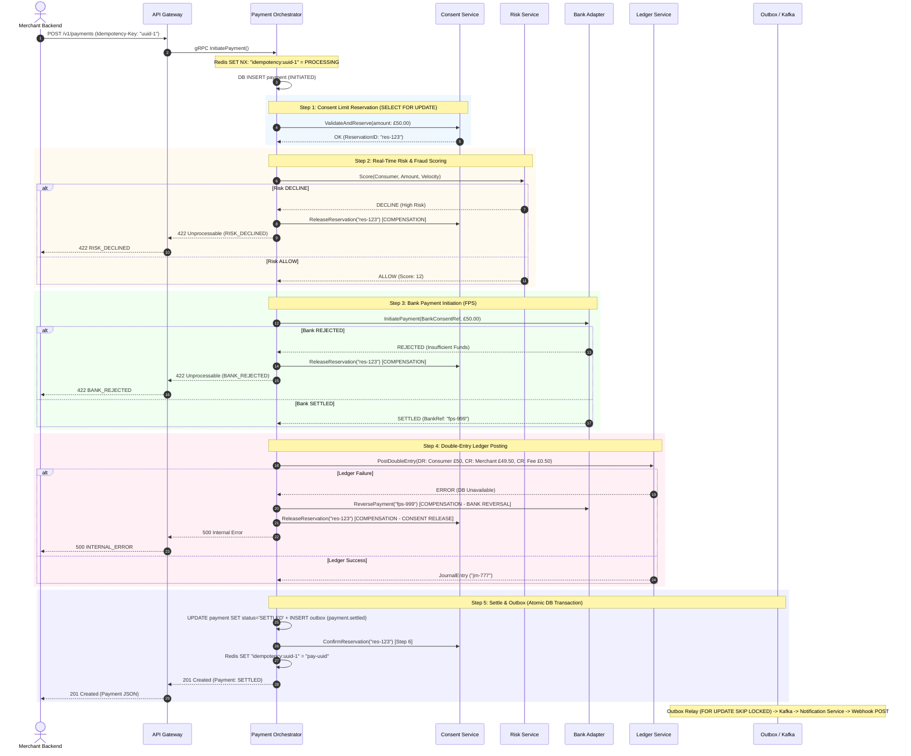
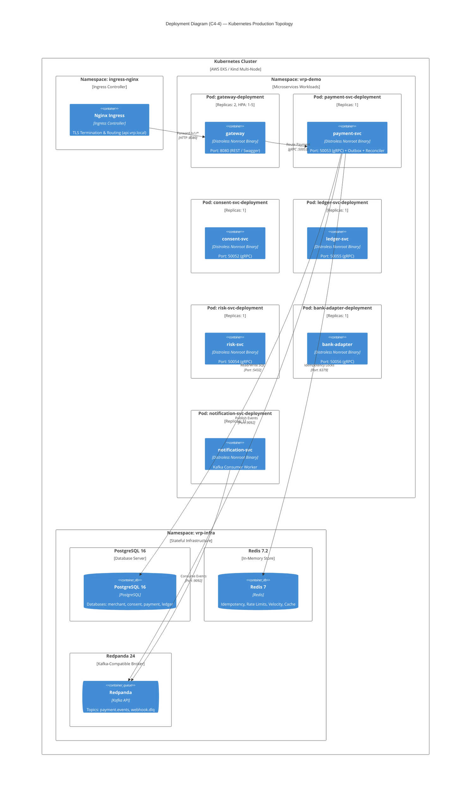

# 🏛️ VRP One-Click Deposit Platform

[](https://golang.org)
[](https://grpc.io)
[](LICENSE)
[](https://www.openbanking.org.uk)

A production-grade, event-driven Open Banking **Variable Recurring Payments (VRP) One-Click Deposit Platform** implemented in **Go**.

The platform demonstrates how to build resilient financial infrastructure handling Pay-by-Bank initiation, real-time fraud scoring, consent lifecycle and limit reservations, distributed saga compensation, crash recovery reconciliation, and immutable double-entry ledger accounting.

---

## 📑 Table of Contents

1. [What is VRP & Why It Matters](#-what-is-vrp--why-it-matters)
2. [Key Technical Patterns Implemented](#-key-technical-patterns-implemented)
3. [System Architecture — C4 Diagrams](#-system-architecture--c4-diagrams)
   - [3.1 C4 Level 1: System Context](#31-c4-level-1-system-context)
   - [3.2 C4 Level 2: Container Diagram](#32-c4-level-2-container-diagram)
   - [3.3 C4 Level 3: Component Diagrams](#33-c4-level-3-component-diagrams)
   - [3.4 C4 Level 4: Saga Execution & Compensation Sequence](#34-c4-level-4-saga-execution--compensation-sequence)
   - [3.5 C4 Level 4: Kubernetes Deployment Topology](#35-c4-level-4-kubernetes-deployment-topology)
4. [Microservices Inventory](#-microservices-inventory)
5. [Quick Start & Local Run](#-quick-start--local-run)
6. [API Endpoints & Ports](#-api-endpoints--ports)
7. [Testing & Verification](#-testing--verification)
8. [Documentation & Deep-Dives](#-documentation--deep-dives)

---

## 💡 What is VRP & Why It Matters?

In traditional e-commerce or iGaming, depositing via a bank requires customer redirection to their banking app on **every single transaction** due to Strong Customer Authentication (SCA) under PSD2.

**Variable Recurring Payments (VRP)** fundamentally changes this:
1. **First-time deposit (Consent)**: The customer authenticates once via their banking app to approve a parameterized VRP consent (e.g., maximum £200 per transaction, £1,000 per rolling 30-day window).
2. **Repeat deposits (One-Click)**: The merchant calls the API Gateway to pull funds immediately within the consented limits. The payment settles in **< 500ms** with zero user friction (no redirect, no Face ID, no SMS OTP).

---

## 🛠️ Key Technical Patterns Implemented

| Pattern | Implementation Details |
|---|---|
| **Saga Orchestration** | 6-step distributed saga with non-short-circuiting multi-step compensation matrix (`Consent` → `Risk` → `Bank` → `Ledger` → `Settle` → `Confirm`). |
| **In-Flight Crash Recovery** | Background `ReconciliationWorker` polling stale in-flight transactions, querying bank status, and executing automated resume or rollback. |
| **Transactional Outbox** | Atomically updates payment status, writes audit events, and inserts outbox rows in a single DB transaction with `FOR UPDATE SKIP LOCKED`. |
| **Double-Entry Bookkeeping** | PostgreSQL `DEFERRABLE INITIALLY DEFERRED` constraint trigger enforcing $\sum \text{Debits} = \sum \text{Credits}$ with `SERIALIZABLE` isolation. |
| **Layered Idempotency** | Redis `SET NX` distributed lock + DB unique constraints + 24h consumer deduplication. |
| **Zero-Alloc Webhook HMAC** | Stack-buffered HMAC-SHA256 signing with 5-minute replay tolerance window (`VerifyWithTolerance`). |
| **Atomic Redis Rate Limiting** | Gateway Token Bucket implemented via single-roundtrip atomic Lua script (`rateLimitLua`). |
| **Structured Error Details** | gRPC error propagation using `google.rpc.ErrorInfo` metadata instead of fragile string matching. |
| **Resilient Bank Adapter** | Anti-corruption layer with `gobreaker` circuit breaker (10 consecutive failures) and `retry-go` exponential backoff. |
| **Trace Context Propagation** | W3C `traceparent` metadata extraction and context-aware `slog.TraceHandler` logging (`trace_id`, `span_id`, `request_id`). |

---

## 📐 System Architecture — C4 Diagrams

### 3.1 C4 Level 1: System Context



---

### 3.2 C4 Level 2: Container Diagram

```mermaid
C4Container
    title Container Diagram (C4-2) — Microservices & Infrastructure Topology

    Person(merchant, "Merchant Backend", "API Client")
    
    Container_Boundary(c1, "VRP One-Click Platform Boundary") {
        Container(gateway, "API Gateway", "Go / Chi Router (:8080)", "JWT authentication, Redis Token Bucket rate limiting, and HTTP→gRPC proxying.")
        
        Container(merchant_svc, "Merchant Service", "Go / gRPC (:50051)", "Merchant onboarding, KYB verification, and bcrypt API Key hashing.")
        Container(consent_svc, "Consent Service", "Go / gRPC (:50052)", "Consent lifecycle, rolling 30-day limit tracking, and pessimistic reservation locks.")
        Container(payment_svc, "Payment Orchestrator", "Go / gRPC (:50053)", "6-step saga orchestrator, transactional outbox relay, and in-flight crash reconciler.")
        Container(risk_svc, "Risk Service", "Go / gRPC (:50054)", "Real-time fraud scoring (<50ms), Redis velocity counters, and blocklist rules.")
        Container(ledger_svc, "Ledger Service", "Go / gRPC (:50055)", "Double-entry bookkeeping with SERIALIZABLE isolation and PostgreSQL balance triggers.")
        Container(bank_adapter, "Bank Adapter", "Go / gRPC (:50056)", "Open Banking anti-corruption layer with gobreaker circuit breaker and retries.")
        Container(notification_svc, "Notification Service", "Go Worker", "Consumes payment.events from Kafka and delivers HMAC-signed webhooks with DLQ fallback.")

        ContainerDb(db_merchant, "Merchant DB", "PostgreSQL", "Merchants and API key hashes.")
        ContainerDb(db_consent, "Consent DB", "PostgreSQL", "Consents, rolling usage, and active reservations.")
        ContainerDb(db_payment, "Payment DB", "PostgreSQL", "Payment states, audit event log, and transactional outbox.")
        ContainerDb(db_ledger, "Ledger DB", "PostgreSQL", "Accounts, journal entries, and journal lines with trigger.")
        
        Container(redis_infra, "Redis", "Redis 7", "Idempotency locks, rate limits, velocity counters, and consent cache.")
        ContainerQueue(kafka_broker, "Redpanda / Kafka", "Kafka API (:9092)", "Topics: payment.events (Outbox) and webhook.dlq (DLQ).")
    }

    System_Ext(mock_bank, "Mock Bank Engine", "Simulated Open Banking FPS Engine (:18080)")

    Rel(merchant, gateway, "HTTPS REST / JSON", ":8080 (Bearer JWT / Idempotency-Key)")
    
    Rel(gateway, merchant_svc, "gRPC", ":50051")
    Rel(gateway, consent_svc, "gRPC", ":50052")
    Rel(gateway, payment_svc, "gRPC", ":50053")

    Rel(payment_svc, consent_svc, "gRPC", "1. ValidateAndReserve / 6. Confirm")
    Rel(payment_svc, risk_svc, "gRPC", "2. Score (Fraud Check)")
    Rel(payment_svc, bank_adapter, "gRPC", "3. InitiatePayment")
    Rel(payment_svc, ledger_svc, "gRPC", "4. PostDoubleEntry")

    Rel(bank_adapter, mock_bank, "HTTP REST", "FPS Payment Initiation")

    Rel(merchant_svc, db_merchant, "SQL / pgxpool", "merchant schema")
    Rel(consent_svc, db_consent, "SQL / pgxpool", "consent schema (SELECT FOR UPDATE)")
    Rel(consent_svc, redis_infra, "TCP", "Consent Cache")
    Rel(payment_svc, db_payment, "SQL / pgxpool", "payment & outbox tables")
    Rel(payment_svc, redis_infra, "TCP", "Idempotency SET NX")
    Rel(risk_svc, redis_infra, "TCP", "Velocity Counters & Blocklist")
    Rel(ledger_svc, db_ledger, "SQL / pgxpool", "SERIALIZABLE Tx")

    Rel(payment_svc, kafka_broker, "TCP", "Publish payment.events (RequireAll)")
    Rel(notification_svc, kafka_broker, "TCP", "Consume payment.events & Publish DLQ")
    Rel(notification_svc, merchant_svc, "gRPC", "GetWebhookConfig (HMAC Secret)")
    Rel(notification_svc, merchant, "HTTPS POST", "Signed Webhook (X-PC-Signature)")
```



---

### 3.3 C4 Level 3: Component Diagrams

#### Payment Orchestrator Component Diagram (`services/payment-svc`)


#### Ledger Service Component Diagram (`services/ledger-svc`)


---

### 3.4 C4 Level 4: Saga Execution & Compensation Sequence



---

### 3.5 C4 Level 4: Kubernetes Deployment Topology



---

## 📦 Microservices Inventory

| Service | Protocol / Port | Primary Responsibility | Backing Storage |
|---|---|---|---|
| **API Gateway** | HTTP `:8080` | JWT auth, Rate limiting (Lua), HTTP→gRPC proxying | Redis |
| **Merchant Service** | gRPC `:50051` | Merchant registration, KYB status, bcrypt API key hash | PostgreSQL (`merchant`) |
| **Consent Service** | gRPC `:50052` | VRP consent lifecycle, rolling usage, `FOR UPDATE` locks | PostgreSQL (`consent`) + Redis |
| **Payment Service** | gRPC `:50053` | 6-step saga orchestration, outbox relay, crash recovery | PostgreSQL (`payment`) + Redis + Kafka |
| **Risk Service** | gRPC `:50054` | Rule engine (HighValue, Velocity, Blocklist) (<50ms) | Redis |
| **Ledger Service** | gRPC `:50055` | Double-entry accounting with SERIALIZABLE isolation | PostgreSQL (`ledger`) |
| **Bank Adapter** | gRPC `:50056` | Open Banking anti-corruption layer + circuit breaker | Mock Bank HTTP (`:18080`) |
| **Notification Service**| Kafka Consumer | Consumes `payment.events`, signs HMAC webhooks, DLQ | Redis (Dedup) + Kafka |

---

## 🚀 Quick Start & Local Run

### Prerequisites
- **Go 1.23+** (or Go 1.26.2)
- **Docker** & **Docker Compose**
- **buf** (`go install github.com/bufbuild/buf/cmd/buf@latest`)

### 1. Start Infrastructure
```bash
# Spins up PostgreSQL, Redis, Redpanda (Kafka), Jaeger, Prometheus, Grafana
make up
```

### 2. Build & Run Services
```bash
# Build all 8 Go microservice binaries into ./bin/
make build

# Start all 8 services in background with pid & log tracking
./scripts/run-all.sh
# or: make run-all
```

### 3. Run End-to-End Smoke Test
```bash
# Executes full flow: Register merchant -> Mint JWT -> Create Consent -> Initiate Payment (Saga Settled) -> Webhook Delivery
./scripts/e2e-smoke.sh
```

### 4. Stop Services
```bash
./scripts/stop-all.sh
```

---

## 🔌 API Endpoints & Ports

| Service / Tool | Endpoint / URL | Description |
|---|---|---|
| **API Gateway REST** | `http://localhost:8080/v1/...` | Core REST API |
| **Swagger UI Documentation**| `http://localhost:8080/docs` | Interactive OpenAPI 3.0 UI |
| **OpenAPI Spec YAML** | `http://localhost:8080/docs/openapi.yaml` | Raw OpenAPI spec |
| **Jaeger Tracing UI** | `http://localhost:16686` | Distributed trace viewer |
| **Grafana Dashboards** | `http://localhost:3000` | Metrics & dashboards (admin/admin) |
| **Prometheus Metrics** | `http://localhost:9090` | Raw Prometheus TSDB |
| **Redpanda Kafka Console** | `localhost:19092` | Kafka broker port |
| **PostgreSQL** | `localhost:5432` (`vrp:vrp`) | Multi-tenant databases |

---

## 🧪 Testing & Verification

The project includes unit tests, in-memory mocks, `miniredis` suites, and full end-to-end integration scripts.

```bash
# Run all unit and integration test suites across all packages and services
make test

# Run static analysis linter across the Go workspace
make lint
```

---

## 📚 Documentation & Deep-Dives

* **[Code Quality & Architecture Review Report](CODE_QUALITY_REPORT.md)** — Comprehensive 1600+ line technical audit covering coverage matrices, security catalog, and 4-week remediation roadmap.
* **[VRP Architecture Review (English)](VRP_ARCHITECTURE_AND_GO_CODE_REVIEW_EN.md)** — Deep-dive architecture review by Principal Engineer & Go Author.
* **[VRP Technical Blog Post (English)](blog-vrp-go-microservices-EN.md)** — In-depth article on UK Open Banking VRP timeline, patterns, and Go design.
* **[VRP Technical Blog Post (Turkish)](blog-vrp-go-microservices-TR.md)** — Türkçe detaylı VRP rehberi, mimari desenler ve Go ekosistemi.
