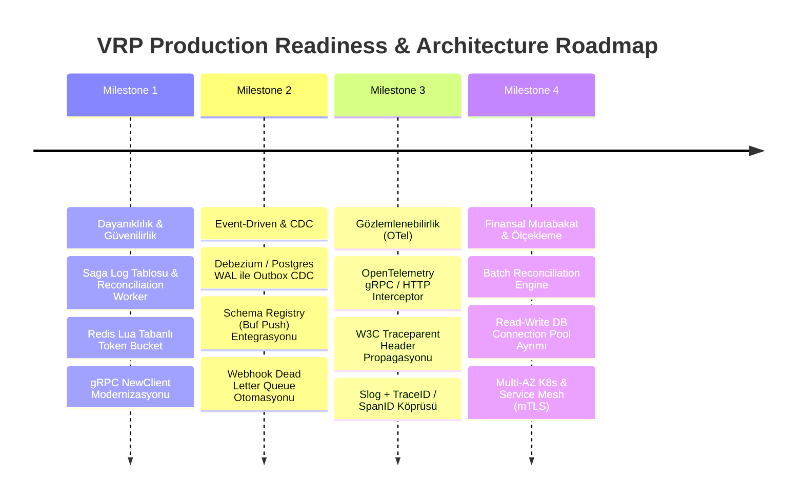
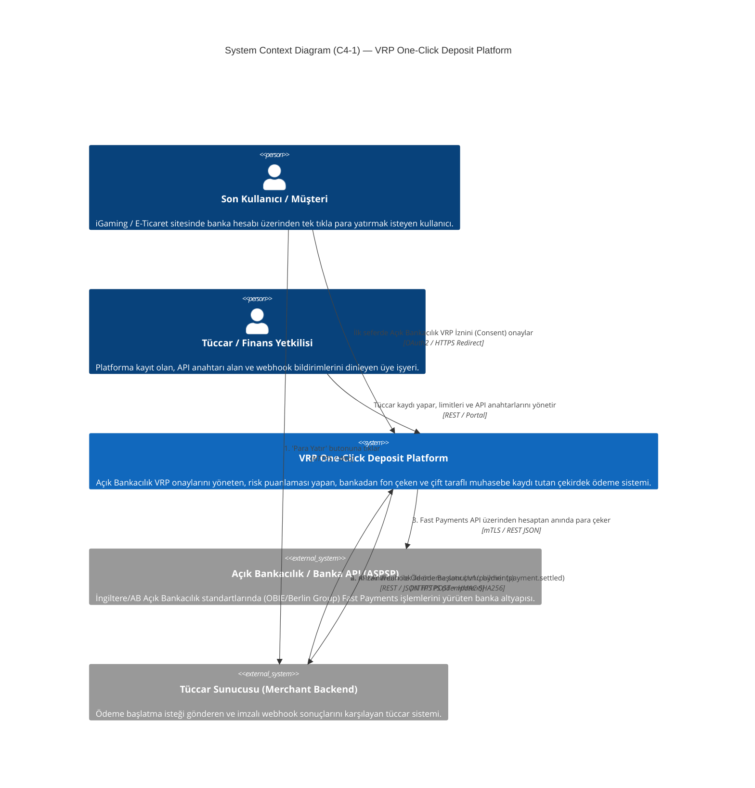
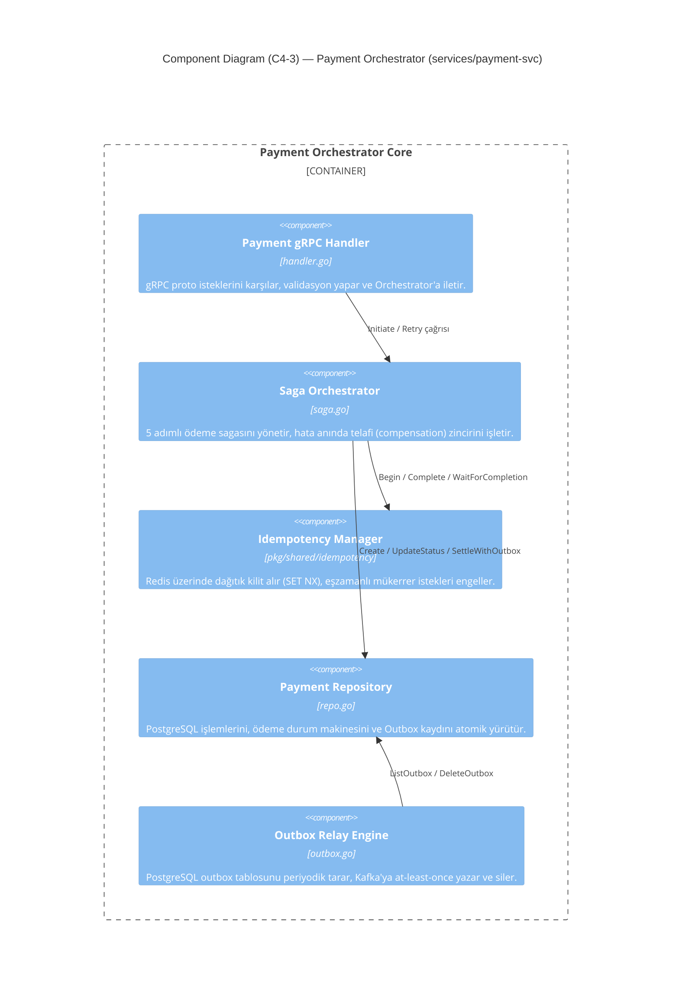
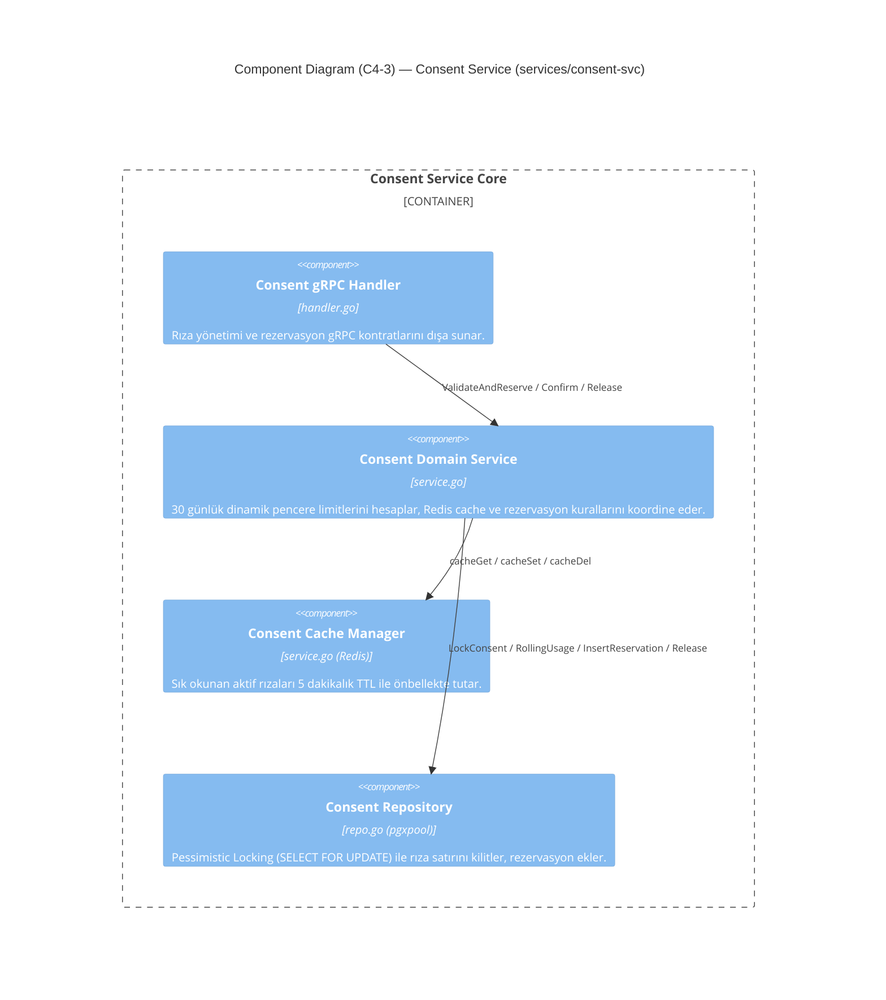
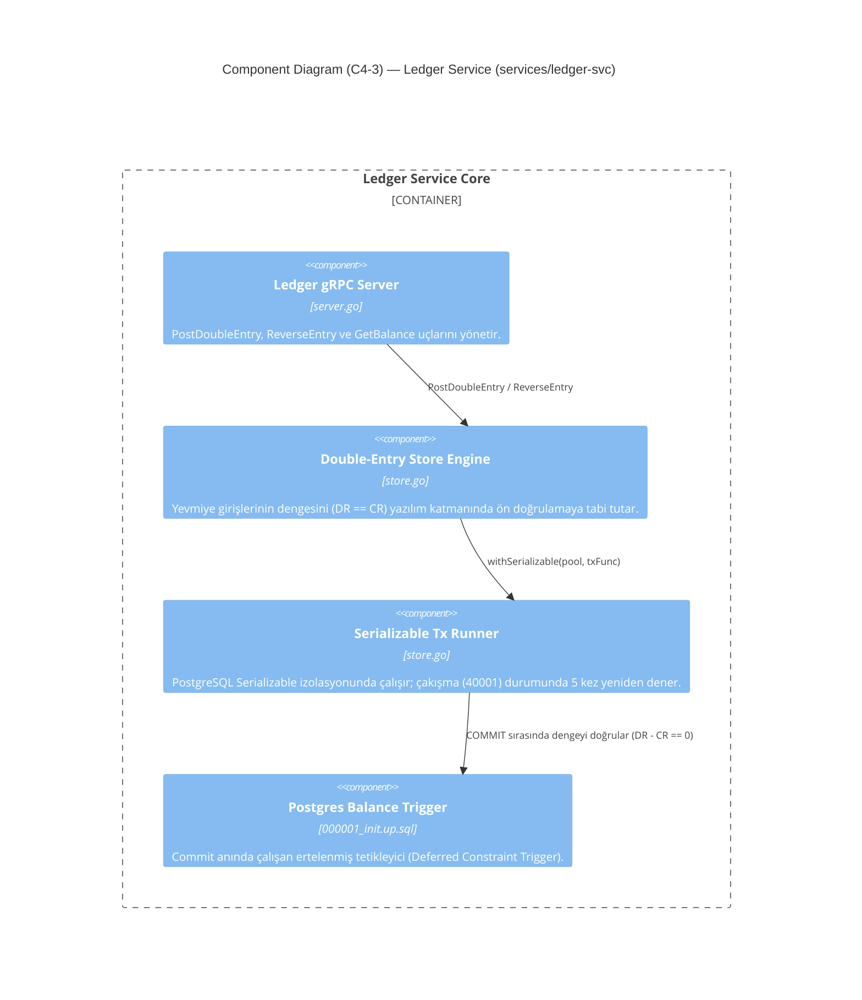
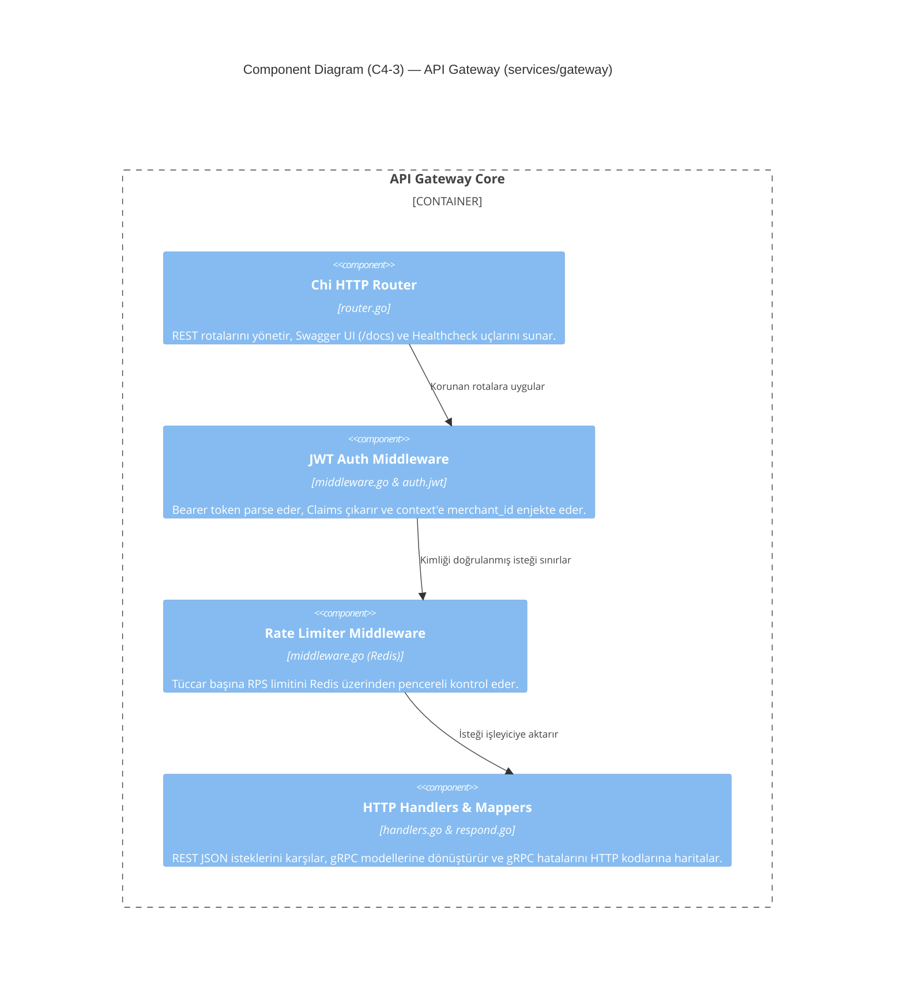
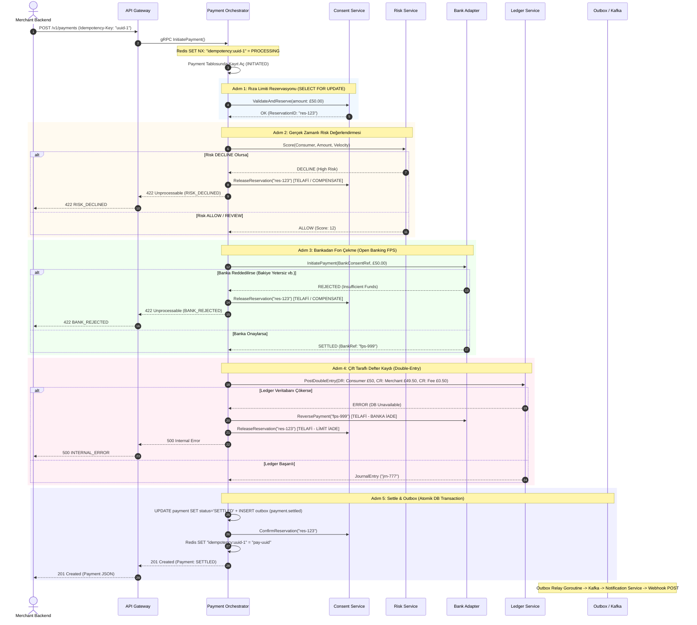
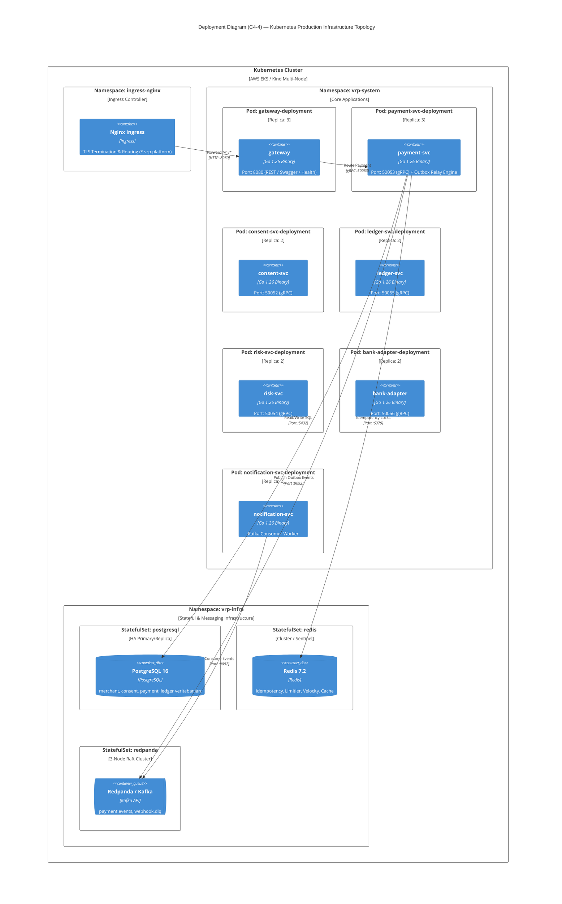

# 🏛️ VRP One-Click Deposit Platform — Principal Software Engineer & Go Author Architecture & Code Review

**Yazar**: Principal Software Engineer & Go Author / System Architect  
**Tarih**: 2026-08-14  
**Proje**: Variable Recurring Payments (VRP) One-Click Deposit Platform  
**Hedef Go Sürümü**: Go 1.23+ (Go Workspace: Go 1.26.2)  
**Doküman Sürümü**: v1.1.0-PROD-REVIEW-WITH-REMEDIATIONS  

---

## 📑 İçindekiler
1. [Yönetici Özeti & Mimari Olgunluk Skoru](#1-yönetici-özeti--mimari-olgunluk-skoru)
2. [Go Dili Özellikleri ve Modernizasyon Analizi (Go 1.21 – Go 1.26)](#2-go-dili-özellikleri-ve-modernizasyon-analizi-go-121--go-126)
3. [Kod Kalitesi, Go Idiomları ve Temiz Kod (Clean Code) Değerlendirmesi](#3-kod-kalitesi-go-idiomları-ve-temiz-kod-clean-code-değerlendirmesi)
4. [Mevcut Kod Tabanındaki Hatalar, Anti-Pattern'ler ve Güvenlik/Performans Riskleri](#4-mevcut-kod-tabanındaki-hatalar-anti-patternler-ve-güvenlikperformans-riskleri)
5. [Kritik Riskler İçin Somut Çözüm Önerileri ve Üretime Hazır Kod Blokları (Remediation Guide)](#5-kritik-riskler-için-somut-çözüm-önerileri-ve-üretime-hazır-kod-blokları-remediation-guide)
   - [5.1 Çözüm 1: Redis Rate Limiter Atomik Lua Scripti](#51-çözüm-1-redis-rate-limiter-atomik-lua-scripti)
   - [5.2 Çözüm 2: Saga State Machine & Distributed Reconciliation Worker](#52-çözüm-2-saga-state-machine--distributed-reconciliation-worker)
   - [5.3 Çözüm 3: Webhook Sıfır Bellek Tahsisatlı (Zero-Alloc) HMAC İmzalama](#53-çözüm-3-webhook-sıfır-bellek-tahsisatlı-zero-alloc-hmac-imzalama)
   - [5.4 Çözüm 4: Transactional Outbox: SKIP LOCKED ve Debezium CDC](#54-çözüm-4-transactional-outbox-skip-locked-ve-debezium-cdc)
   - [5.5 Çözüm 5: Modern gRPC NewClient ve Bağlantı Havuzu Yönetimi](#55-çözüm-5-modern-grpc-newclient-ve-bağlantı-havuzu-yönetimi)
   - [5.6 Çözüm 6: OpenTelemetry Dağıtık İzleme (Distributed Tracing) & Slog Entegrasyonu](#56-çözüm-6-opentelemetry-dağıtık-izleme-distributed-tracing--slog-entegrasyonu)
6. [Dağıtık Sistem Desenleri ve Mimari İnceleme (Deep-Dive)](#6-dağıtık-sistem-desenleri-ve-mimari-inceleme-deep-dive)
7. [Principal Architect İyileştirme Önerileri ve Hedef Mimari Yol Haritası](#7-principal-architect-iyileştirme-önerileri-ve-hedef-mimari-yol-haritası)
8. [Mermaid Formatında Tam C4 Mimari Diyagramları](#8-mermaid-formatında-tam-c4-mimari-diyagramları)
   - [8.1 C4 Level 1: System Context Diagram (Sistem Bağlamı)](#81-c4-level-1-system-context-diagram-sistem-bağlamı)
   - [8.2 C4 Level 2: Container Diagram (Kapsayıcı / Servis Topolojisi)](#82-c4-level-2-container-diagram-kapsayıcı--servis-topolojisi)
   - [8.3 C4 Level 3: Component Diagrams (Bileşen Seviyesi)](#83-c4-level-3-component-diagrams-bileşen-seviyesi)
     - [8.3.1 Payment Orchestrator Component Diagram](#831-payment-orchestrator-bileşen-diyagramı)
     - [8.3.2 Consent Service Component Diagram](#832-consent-service-bileşen-diyagramı)
     - [8.3.3 Ledger Service Component Diagram](#833-ledger-service-bileşen-diyagramı)
     - [8.3.4 API Gateway Component Diagram](#834-api-gateway-bileşen-diyagramı)
   - [8.4 C4 Level 4: Code & Sequence / Deployment Diagrams](#84-c4-level-4-code--sequence--deployment-diagrams)
     - [8.4.1 C4 Dynamic / Sequence: Payment Saga Execution & Rollback](#841-c4-dynamic--sequence-payment-saga-execution--rollback)
     - [8.4.2 C4 Deployment Diagram (Kubernetes Topology)](#842-c4-deployment-diagram-kubernetes-fiziksel-dağıtımı)

---

## 1. Yönetici Özeti & Mimari Olgunluk Skoru

Bu proje, Açık Bankacılık (Open Banking) regülasyonlarına uygun olarak iGaming ve e-ticaret gibi yüksek hacimli sektörler için geliştirilmiş bir **Variable Recurring Payments (VRP) Tek Tıkla Para Yatırma (One-Click Deposit)** platformudur.

Proje; mikroservis ayrımı, veri tutarlılığı, finansal kesinlik (double-entry ledger) ve asenkron olay yönetimi konularında **oldukça yüksek bir mühendislik vizyonuyla** tasarlanmıştır.

### 📊 Mimari & Kod Olgunluk Matrisi

| Değerlendirme Alanı | Puan (1-10) | Durum | Kısa Değerlendirme |
| :--- | :---: | :---: | :--- |
| **Mimari Tasarım & Desenler** | **9.2 / 10** | 🟢 Mükemmel | Saga Orchestration, Outbox, Double-entry ledger, Idempotency kusursuz modellenmiş. |
| **Finansal Doğruluk & Veri Güvenliği** | **9.5 / 10** | 🟢 Mükemmel | Kuruş bazlı tamsayı (`Money`), PostgreSQL kısıt tetikleyicisi (`deferred trigger`), Serializable izolasyon. |
| **Go Idiomları & Modern Dili Kullanım** | **8.5 / 10** | 🟡 İyi / Geliştirilebilir | `log/slog`, `any`, `range-over-int` kullanılmış; `cmp.Or`, `slices`/`maps`, OTel entegrasyonu eksik. |
| **Hata Yönetimi & Domain Hataları** | **9.0 / 10** | 🟢 Mükemmel | Domain hataları ile gRPC/HTTP durum kodları `pkg/shared/domainerr` ile tertemiz soyutlanmış. |
| **Eşzamanlılık (Concurrency) & Güvenlik** | **8.0 / 10** | 🟡 İyi / Riskler Var | Graceful shutdown başarılı; Redis rate-limiter ve idempotency'de küçük yarış durumları (race condition) mevcut. |
| **Gözlemlenebilirlik (Observability)** | **6.5 / 10** | 🔴 Kritik Eksik | `slog` var fakat OpenTelemetry distributed tracing (W3C traceparent) ve prometheus metrikleri eksik. |
| **Test Edilebilirlik & Kapsama** | **8.5 / 10** | 🟢 Çok İyi | Masaüstü mock'lar, miniredis, fake repo'lar ve e2e duman testleri mevcut; testcontainers eksik. |

---

## 2. Go Dili Özellikleri ve Modernizasyon Analizi (Go 1.21 – Go 1.26)

Proje, kök dizindeki `go.work` dosyasında `go 1.26.2` sürümünü hedeflemektedir. Modern Go ekosisteminin sunduğu yeniliklerin projede nasıl kullanıldığı ve nelerin ıskalandığı aşağıda detaylandırılmıştır:

### 2.1 Başarıyla Uygulanan Modern Go Özellikleri

1. **Yapılandırılmış Loglama (`log/slog` - Go 1.21+)**:
   - `services/*/cmd/main.go` ve `pkg/shared/grpcutil/server.go` içerisinde `log/slog` JSON handler ile yapılandırılmış, `slog.With` ve context duyarlı `slog.InfoContext` / `slog.ErrorContext` metodları kullanılmıştır.
   - Üçüncü parti ağır loglama kütüphaneleri (zap/logrus) yerine standart kütüphane standardı benimsenmiştir.

2. **Tip Bildirimlerinde `any` Standartlaşması (Go 1.18+)**:
   - `interface{}` yerine tamamen `any` anahtar kelimesi kullanılarak tip okunabilirliği artırılmıştır.

3. **Tamsayı Üzerinde Döngü (`range-over-int` - Go 1.22+)**:
   - `services/ledger-svc/internal/store.go:403` satırında:
     ```go
     for range maxAttempts {
         err := pgx.BeginTxFunc(ctx, pool, pgx.TxOptions{IsoLevel: pgx.Serializable}, fn)
         // ...
     }
     ```
     Klasik `for i := 0; i < maxAttempts; i++` yerine Go 1.22'nin zarif `for range N` sözdizimi kullanılmıştır.

4. **Gelişmiş Hata Sarmalama (`errors.Is` / `errors.As` - Go 1.13+)**:
   - `pkg/shared/domainerr/errors.go` ve veritabanı sürücülerinde (`pgconn.PgError`) hata türü kontrolleri `errors.As` ile tip güvenli biçimde yapılmaktadır.

5. **`signal.NotifyContext` ile Temiz Kapanma (Graceful Shutdown - Go 1.16+)**:
   - Tüm `main.go` giriş noktalarında işletim sistemi sinyalleri (`SIGINT`, `SIGTERM`) context iptali ile bağlanmış ve 10-15 saniyelik tahliye (drain) süreleriyle kontrollü kapatma sağlanmıştır.

6. **Go 1.26 `new(expr)` Sentaksı**:
   - `services/payment-svc/internal/saga.go:264` satırında:
     `p.RiskScore = new(scoreResp.GetScore())`
     Bu sentaks Go 1.26 ile gelen ifade işaretçisi oluşturma özelliğidir.

---

### 2.2 Kaçırılan Modernizasyon Fırsatları & İyileştirmeler

#### 1. `cmp.Or` (Go 1.22+) Kullanılmaması
`pkg/shared/config/env.go` dosyasında ortam değişkeni varsayılan değerleri elle yazılmıştır:
```go
// Mevcut Kod (pkg/shared/config/env.go)
func Get(key, def string) string {
    if v := os.Getenv(key); v != "" {
        return v
    }
    return def
}
```
**Go 1.22+ İdiomatik Karşılığı:**
```go
import "cmp"

func Get(key, def string) string {
    return cmp.Or(os.Getenv(key), def)
}
```

#### 2. `slices` ve `maps` Standart Paketlerinin (Go 1.21+) Eksikliği
- Dilim kopyalama, sıralama, arama ve filtreleme operasyonlarında `slices.Contains`, `slices.Clone`, `slices.SortFunc` kullanılabilir.

#### 3. Deprecated `grpc.DialContext` / `grpc.WithInsecure` Kullanımı
`pkg/shared/grpcutil/server.go:111-117` dosyasında gRPC v1.63+ ile kullanımdan kaldırılan (deprecated) API'ler yer almaktadır.

---

## 3. Kod Kalitesi, Go Idiomları ve Temiz Kod (Clean Code) Değerlendirmesi

### 3.1 Üstün Mühendislik Tercihleri (Highlights)

1. **Finansal Doğruluk (`pkg/shared/money/money.go`)**:
   - `float64` kullanımı tamamen yasaklanmış; para değerleri tamsayı (pence/cent - minor units) ve ISO 4217 para birimi koduyla temsil edilmiştir.
   - Yuvarlama hataları (floating point precision issues) sıfıra indirilmiştir.

2. **Domain Hata Yönetimi (`pkg/shared/domainerr`)**:
   - Go'nun en kritik zorluklarından biri olan domain hatalarının taşınması, `Code` enum'ları ve gRPC `status.Status` eşlemesi ile kusursuz çözülmüştür.

3. **Veritabanı İşlem Güvenliği (pgx/v5 İdiomları)**:
   - `pgx.BeginFunc(ctx, pool, func(tx pgx.Tx) error { ... })` kalıbı kullanılarak commit/rollback akışları closure içerisinde otomatik ve sızıntısız yönetilmiştir.
   - `ledger-svc` içinde `Serializable` izolasyon seviyesi uygulanmış, PostgreSQL `40001` (serialization_failure) ve `40P01` (deadlock_detected) hataları tespit edilip üstel geri çekilme (backoff) ile yeniden denenmektedir.

4. **API Key Güvenliği ve Arama Performansı**:
   - `services/merchant-svc/internal/repo.go` içinde API anahtarları `vrp_<32-hex>` formatında üretilmekte, ilk 8 karakterlik `key_prefix` B-Tree indeksinde aranmakta ($O(1)$) ve veri tabanında yalnızca bcrypt hash'i tutulmaktadır.

---

## 4. Mevcut Kod Tabanındaki Hatalar, Anti-Pattern'ler ve Güvenlik/Performans Riskleri

Statik analiz ve kod incelemesinde tespit edilen 6 kritik risk:

1. **Redis Rate Limiter TTL Yarış Durumu (Race Condition)**: `Incr` ile `Expire` arasındaki crash durumunda kalıcı bloklanma riski.
2. **Bellek İçi Saga Durum Takipsizliği (In-Flight Crash Risk)**: Bankadan para çekildikten sonra pod çökerse işlemin askıda kalması ve telafi edilememesi.
3. **Webhook HMAC İmzasında Aşırı Bellek Tahsisi (Allocation Waste)**: `fmt.Sprintf` ve `string(body)` kaynaklı GC baskısı.
4. **Transactional Outbox Tablosundaki Polling ve Çakışma Yükü**: Çoklu podlarda çift Kafka mesajı veya DB şişmesi (bloat) riski.
5. **Kullanımdan Kaldırılmış (Deprecated) gRPC Dial Metodları**: `grpc.DialContext`, `WithBlock` ve `WithInsecure` riskleri.
6. **Dağıtık İzleme (Tracing) Eksikliği**: Mikroservis zincirinde W3C `traceparent` taşınmaması ve loglarda `trace_id` bulunmaması.

---

## 5. Kritik Riskler İçin Somut Çözüm Önerileri ve Üretime Hazır Kod Blokları (Remediation Guide)

### 5.1 Çözüm 1: Redis Rate Limiter Atomik Lua Scripti

#### 📌 Problem
`services/gateway/internal/httpapi/middleware.go:132-140` satırlarında `Incr` ve `Expire` iki ayrı ağ çağrısıdır. `Incr` sonrası pod crash olursa anahtar sonsuza kadar TTL'siz kalır.

#### 💡 Çözüm Kodu:
```go
package httpapi

import (
	"context"
	_ "embed"
	"net/http"
	"strconv"
	"time"

	"github.com/redis/go-redis/v9"
)

// Atomik Rate Limit Lua Scripti
var rateLimitLua = redis.NewScript(`
local key = KEYS[1]
local limit = tonumber(ARGV[1])
local current = redis.call('INCR', key)
if current == 1 then
    redis.call('EXPIRE', key, 2) -- İlk artışta 2 saniye TTL koy
end
if current > limit then
    return 0 -- Limit aşıldı
else
    return 1 -- İzin verildi
end
`)

func RateLimitMiddleware(rdb *redis.Client, limitPerSec int) func(http.Handler) http.Handler {
	if limitPerSec <= 0 {
		limitPerSec = 100
	}
	return func(next http.Handler) http.Handler {
		return http.HandlerFunc(func(w http.ResponseWriter, r *http.Request) {
			if rdb == nil {
				next.ServeHTTP(w, r)
				return
			}
			merchantID := MerchantIDFrom(r.Context())
			if merchantID == "" {
				next.ServeHTTP(w, r)
				return
			}

			ctx := r.Context()
			window := time.Now().Unix()
			key := "ratelimit:" + merchantID + ":" + strconv.FormatInt(window, 10)

			// Tek bir roundtrip ve atomik çalıştırma:
			allowed, err := rateLimitLua.Run(ctx, rdb, []string{key}, limitPerSec).Int()
			if err != nil {
				// Redis arızasında graceful fallback (fail-open)
				next.ServeHTTP(w, r)
				return
			}

			if allowed == 0 {
				w.Header().Set("Retry-After", "1")
				writeError(w, r, http.StatusTooManyRequests, "RATE_LIMITED", "rate limit exceeded")
				return
			}

			next.ServeHTTP(w, r)
		})
	}
}
```

---

### 5.2 Çözüm 2: Saga State Machine & Distributed Reconciliation Worker

#### 📌 Problem
`services/payment-svc/internal/saga.go` tek bir goroutine içinde çalışır. Bankadan para çekildikten sonra pod ölürse bellek uçar; para çekilmiş ama deftere işlenmemiş ve tüccara bildirilmemiş kalır.

#### 💡 Mimari & Çözüm Kodu:

```mermaid
graph TD
    A[Payment Status: AUTHORISING / RESERVED] -->|Pod Crash Olursa| B[(PostgreSQL DB)]
    C[Reconciliation Worker Goroutine] -->|Her 30s Tara: updated_at < NOW - 1m| B
    C -->|Banka Durumunu Sorgula| D[Bank Adapter: GetPaymentStatus]
    D -->|Banka Onayladıysa (SETTLED)| E[Ledger Kaydını At & Settle Et]
    D -->|Banka Reddettiyse/Bilinmiyorsa| F[ReverseBank & ReleaseConsent Telafisi Yap]
```

```go
package internal

import (
	"context"
	"log/slog"
	"time"

	bankv1 "github.com/netologist/vrp-oneclick-deposit-platform/gen/bank/v1"
)

type ReconciliationWorker struct {
	repo         *Repo
	orchestrator *Orchestrator
	bank         bankv1.BankAdapterClient
	interval     time.Duration
	staleAfter   time.Duration
}

func NewReconciliationWorker(repo *Repo, orch *Orchestrator, bank bankv1.BankAdapterClient) *ReconciliationWorker {
	return &ReconciliationWorker{
		repo:         repo,
		orchestrator: orch,
		bank:         bank,
		interval:     30 * time.Second,
		staleAfter:   1 * time.Minute,
	}
}

func (w *ReconciliationWorker) Start(ctx context.Context) {
	ticker := time.NewTicker(w.interval)
	defer ticker.Stop()

	for {
		select {
		case <-ctx.Done():
			return
		case <-ticker.C:
			w.reconcileStalePayments(ctx)
		}
	}
}

func (w *ReconciliationWorker) reconcileStalePayments(ctx context.Context) {
	// SELECT * FROM payment WHERE status IN ('AUTHORISING', 'CONSENT_RESERVED') AND updated_at < NOW() - INTERVAL '1 minute'
	stalePayments, err := w.repo.ListStaleInFlightPayments(ctx, w.staleAfter)
	if err != nil {
		slog.ErrorContext(ctx, "reconciliation list failed", "err", err)
		return
	}

	for _, p := range stalePayments {
		slog.WarnContext(ctx, "reconciling stale in-flight payment", "payment_id", p.ID, "status", p.Status)

		// 1. Bankaya işlemin durumunu sor (Anti-Corruption Query)
		if p.BankPaymentRef != "" {
			statusResp, err := w.bank.GetPaymentStatus(ctx, &bankv1.StatusRequest{
				BankPaymentRef: p.BankPaymentRef,
			})
			if err != nil {
				slog.ErrorContext(ctx, "failed to query bank status during reconciliation", "payment_id", p.ID, "err", err)
				continue
			}

			if statusResp.Status == bankv1.BankPaymentStatus_SETTLED {
				// Bankada para çekilmiş -> Sagayı 4. adımdan itibaren tamamla (Idempotent Resume)
				_ = w.orchestrator.resumeFromLedger(ctx, p)
				continue
			}
		}

		// 2. Bankada para çekilmemiş veya işlem belirsiz -> Güvenli Telafi (Rollback)
		_ = w.orchestrator.failAndCompensate(ctx, p, "RECONCILIATION_TIMEOUT", true, true, nil)
	}
}
```

---

### 5.3 Çözüm 3: Webhook Sıfır Bellek Tahsisatlı (Zero-Alloc) HMAC İmzalama

#### 📌 Problem
`pkg/shared/webhook/hmac.go:12-17` fonksiyonu her imzada `fmt.Sprintf` ve `string(body)` ile gereksiz string heap allocation üretir.

#### 💡 Çözüm Kodu:
```go
package webhook

import (
	"crypto/hmac"
	"crypto/sha256"
	"encoding/hex"
	"strconv"
	"time"
)

// Zero-allocation HMAC imzalama fonksiyonu
func Sign(secret string, timestamp time.Time, body []byte) string {
	mac := hmac.New(sha256.New, []byte(secret))

	// Stack üzerinde 20 byte'lık küçük tampon (Unix timestamp max 10-19 hane)
	var tsBuf [20]byte
	tsBytes := strconv.AppendInt(tsBuf[:0], timestamp.Unix(), 10)

	// Doğrudan hash buffer'ına yaz (Sıfır string heap allokasyonu)
	_, _ = mac.Write(tsBytes)
	_, _ = mac.Write([]byte{'.'})
	_, _ = mac.Write(body)

	// sha256.Size = 32 byte digest -> 64 byte hex string
	var out [64]byte
	sum := mac.Sum(nil)
	hex.Encode(out[:], sum)

	return "sha256=" + string(out[:])
}

func Verify(secret, signature string, timestamp time.Time, body []byte) bool {
	expected := Sign(secret, timestamp, body)
	return hmac.Equal([]byte(expected), []byte(signature))
}
```

---

### 5.4 Çözüm 4: Transactional Outbox: SKIP LOCKED ve Debezium CDC

#### 📌 Problem
`services/payment-svc/internal/outbox.go` dosyasında `SELECT * FROM outbox LIMIT 100` sorgusu çoklu podlarda aynı satırları okuyarak Kafka'ya mükerrer mesaj basabilir.

#### 💡 Çözüm:
1. **Kısa Vade (SKIP LOCKED)**:
```sql
-- services/payment-svc/internal/repo.go
SELECT id, topic, key, payload, created_at 
FROM outbox 
ORDER BY created_at ASC 
LIMIT $1 
FOR UPDATE SKIP LOCKED;
```

2. **Uzun Vade (Debezium CDC)**:
```mermaid
graph LR
    PaymentTx[(Payment DB)] -->|Postgres WAL (Logical Replication)| Debezium[Debezium CDC Connector]
    Debezium -->|Sıfır Gecikme & DB Yüksüz| Kafka[(Kafka: payment.events)]
    Kafka --> NotificationSvc[Notification Service]
```

---

### 5.5 Çözüm 5: Modern gRPC NewClient ve Bağlantı Havuzu Yönetimi

#### 📌 Problem
`pkg/shared/grpcutil/server.go:111-117` deprecated `grpc.DialContext` ve bloklayıcı `grpc.WithBlock` kullanmaktadır.

#### 💡 Çözüm Kodu:
```go
package grpcutil

import (
	"context"
	"fmt"
	"time"

	"google.golang.org/grpc"
	"google.golang.org/grpc/credentials/insecure"
	"google.golang.org/grpc/keepalive"
)

func Dial(ctx context.Context, addr string) (*grpc.ClientConn, error) {
	opts := []grpc.DialOption{
		// 1. Modern insecure kimlik doğrulaması
		grpc.WithTransportCredentials(insecure.NewCredentials()),
		
		// 2. HTTP/2 TCP Keepalive (Kopan bağlantıları anında tespit eder)
		grpc.WithKeepaliveParams(keepalive.ClientParameters{
			Time:                10 * time.Second,
			Timeout:             3 * time.Second,
			PermitWithoutStream: true,
		}),
		
		// 3. Varsayılan çağrı timeout'u ve hazır olma beklemesi
		grpc.WithDefaultCallOptions(
			grpc.WaitForReady(true),
			grpc.MaxCallRecvMsgSize(4*1024*1024), // 4MB
		),
	}

	// Modern, non-blocking NewClient API
	conn, err := grpc.NewClient(addr, opts...)
	if err != nil {
		return nil, fmt.Errorf("grpc new client %s: %w", addr, err)
	}
	return conn, nil
}
```

---

### 5.6 Çözüm 6: OpenTelemetry Dağıtık İzleme (Distributed Tracing) & Slog Entegrasyonu

#### 📌 Problem
Mikroservisler arasında W3C `traceparent` taşınmadığı için gecikmelerin hangi serviste oluştuğu izlenemez.

#### 💡 Çözüm Kodu:

1. **gRPC Interceptor**:
```go
// pkg/shared/grpcutil/server.go
import "go.opentelemetry.io/contrib/instrumentation/google.golang.org/grpc/otelgrpc"

func NewServer(addr string, opts ...grpc.ServerOption) *Server {
    base := []grpc.ServerOption{
        grpc.ChainUnaryInterceptor(
            otelgrpc.UnaryServerInterceptor(), // W3C TraceContext çıkarır ve context'e koyar
            LoggingUnary(),
            RecoveryUnary(),
        ),
    }
    // ...
}
```

2. **`slog` TraceID / SpanID Enjeksiyon Handler'ı**:
```go
package logutil

import (
	"context"
	"log/slog"

	"go.opentelemetry.io/otel/trace"
)

type TraceHandler struct {
	slog.Handler
}

func (h *TraceHandler) Handle(ctx context.Context, r slog.Record) error {
	span := trace.SpanFromContext(ctx)
	if span.SpanContext().IsValid() {
		r.AddAttrs(
			slog.String("trace_id", span.SpanContext().TraceID().String()),
			slog.String("span_id", span.SpanContext().SpanID().String()),
		)
	}
	return h.Handler.Handle(ctx, r)
}
```

---

## 6. Dağıtık Sistem Desenleri ve Mimari İnceleme (Deep-Dive)

Platformda uygulanan temel dağıtık sistem desenleri:

```
┌────────────────────────────────────────────────────────────────────────────────────────┐
│                               VRP DESIGN PATTERNS ENGINE                               │
├────────────────────────────────┬───────────────────────────────────────────────────────┤
│ 1. Saga Orchestration Pattern  │ Payment Orchestrator (Merkezi Koordinatör, 5 Adım)   │
│ 2. Transactional Outbox        │ PostgreSQL outbox tablosu + Kafka Relay Goroutine     │
│ 3. Double-Entry Bookkeeping    │ PostgreSQL Constraint Trigger (Σ Debits = Σ Credits)  │
│ 4. Distributed Idempotency     │ Redis SET NX EX + Fallback Polling + DB Lock          │
│ 5. Anti-Corruption Layer (ACL) │ Bank Adapter + Circuit Breaker (Sony) + Retries       │
│ 6. Pessimistic Limit Locking   │ Consent Service SELECT ... FOR UPDATE (30-day window) │
└────────────────────────────────┴───────────────────────────────────────────────────────┘
```

---

## 7. Principal Architect İyileştirme Önerileri ve Hedef Mimari Yol Haritası



### Aksiyon ve Öncelik Tablosu

| Öncelik | Aksiyon | İlgili Servis / Paket | Etki | Efor |
| :---: | :--- | :--- | :--- | :---: |
| **P0** | **Redis Rate Limiter Lua Scripti** | `services/gateway/internal/httpapi` | Gateway kilitlenme riskini sıfırlar | 1 Gün |
| **P0** | **gRPC `NewClient` & `insecure.NewCredentials`** | `pkg/shared/grpcutil` | Deprecated API ve deadlock riskini çözer | Yarım Gün |
| **P1** | **Webhook Zero-Alloc HMAC** | `pkg/shared/webhook` | Yüksek hacimde GC ve CPU baskısını düşürür | Yarım Gün |
| **P1** | **Saga Reconciliation Worker** | `services/payment-svc` | Askıda kalan ödemeleri ve para kayıplarını önler | 3 Gün |
| **P1** | **Outbox `SKIP LOCKED`** | `services/payment-svc` | Çoklu podlarda çift mesaj üretimini engeller | 1 Gün |
| **P2** | **OpenTelemetry Interceptor & Trace Loglama** | `pkg/shared/grpcutil` & `services/*` | Uçtan uca hata ve gecikme takibi sağlar | 2 Gün |

---

## 8. Mermaid Formatında Tam C4 Mimari Diyagramları

### 8.1 C4 Level 1: System Context Diagram (Sistem Bağlamı)



---

### 8.2 C4 Level 2: Container Diagram (Kapsayıcı / Servis Topolojisi)

```mermaid
C4Container
    title Container Diagram (C4-2) — Microservices & Infrastructure Topology

    Person(merchant, "Tüccar Sistemi", "API istemcisi")
    
    Container_Boundary(c1, "VRP One-Click Platform Boundary") {
        Container(gateway, "API Gateway", "Go / Chi Router", "Harici istekleri karşılar, JWT doğrulaması, Redis Token Bucket rate limiting ve gRPC yönlendirmesi yapar.")
        
        Container(merchant_svc, "Merchant Service", "Go / gRPC (:50051)", "Tüccar kayıt, KYB onay statüsü ve bcrypt API Key yönetimini üstlenir.")
        Container(consent_svc, "Consent Service", "Go / gRPC (:50052)", "VRP rıza yaşam döngüsü, 30 günlük harcama limitleri ve pessimistic lock rezervasyonunu yönetir.")
        Container(payment_svc, "Payment Orchestrator", "Go / gRPC (:50053)", "5 adımlı dağıtık ödeme sagasını koordine eder, dağıtık idempotency ve transactional outbox işletir.")
        Container(risk_svc, "Risk Service", "Go / gRPC (:50054)", "Gerçek zamanlı fraud puanlaması, Redis velocity kontrolü ve kara liste filtrelemesi (<50ms) yapar.")
        Container(ledger_svc, "Ledger Service", "Go / gRPC (:50055)", "Değişmez çift taraflı (double-entry) defter-i kebir muhasebe kayıtlarını tutar.")
        Container(bank_adapter, "Bank Adapter", "Go / gRPC (:50056)", "Açık bankacılık Anti-Corruption Layer; Circuit Breaker ve Retry politikalarını yönetir.")
        Container(notification_svc, "Notification Service", "Go / Worker", "Kafka'dan payment.events dinler, exponential backoff ile HMAC imzalı webhook fırlatır.")

        ContainerDb(db_merchant, "Merchant DB", "PostgreSQL", "Tüccarlar ve hashlenmiş API anahtarları tablosu.")
        ContainerDb(db_consent, "Consent DB", "PostgreSQL", "Rızalar, kullanım geçmişi ve aktif limit rezervasyonları.")
        ContainerDb(db_payment, "Payment DB", "PostgreSQL", "Ödeme durumları, işlem geçmişi ve Transactional Outbox tablosu.")
        ContainerDb(db_ledger, "Ledger DB", "PostgreSQL", "Hesaplar, yevmiye kayıtları (journal_entry) ve bakiye satırları.")
        
        ContainerDb(redis_infra, "Redis Cluster", "Redis v9", "Idempotency kilitleri, rate limit sayaçları, risk velocity sayaçları ve rıza önbelleği.")
        ContainerQueue(kafka_broker, "Message Broker", "Kafka / Redpanda", "Transactional Outbox olayları (payment.events) ve Hata Kuyruğu (webhook.dlq).")
    }

    System_Ext(mock_bank, "Mock Open Banking Engine", "Simüle edilmiş FPS Banka API (:18080)")

    Rel(merchant, gateway, "HTTPS REST / JSON", "Port :8080 (Bearer JWT / Idempotency-Key)")
    
    Rel(gateway, merchant_svc, "gRPC", "API Key auth & Profil")
    Rel(gateway, consent_svc, "gRPC", "Rıza Oluşturma & İptal")
    Rel(gateway, payment_svc, "gRPC", "Ödeme Başlatma")

    Rel(payment_svc, consent_svc, "gRPC", "1. ValidateAndReserveLimit")
    Rel(payment_svc, risk_svc, "gRPC", "2. Score (Fraud Check)")
    Rel(payment_svc, bank_adapter, "gRPC", "3. InitiatePayment")
    Rel(payment_svc, ledger_svc, "gRPC", "4. PostDoubleEntry")
    Rel(payment_svc, consent_svc, "gRPC", "5. ConfirmReservation")

    Rel(bank_adapter, mock_bank, "HTTP REST", "Open Banking Fast Payments")

    Rel(merchant_svc, db_merchant, "SQL / pgxpool", "merchant.*")
    Rel(consent_svc, db_consent, "SQL / pgxpool", "consent.* (FOR UPDATE)")
    Rel(consent_svc, redis_infra, "TCP", "Consent Cache (5m TTL)")
    Rel(payment_svc, db_payment, "SQL / pgxpool", "payment.* & outbox.*")
    Rel(payment_svc, redis_infra, "TCP", "SET NX EX (Idempotency)")
    Rel(risk_svc, redis_infra, "TCP", "Velocity Counters & Blocklist")
    Rel(ledger_svc, db_ledger, "SQL / pgxpool", "ledger.* (Serializable)")

    Rel(payment_svc, kafka_broker, "TCP / Outbox Relay", "Publish payment.events")
    Rel(notification_svc, kafka_broker, "TCP / Consumer Group", "Consume payment.events & Publish DLQ")
    Rel(notification_svc, merchant_svc, "gRPC", "GetWebhookConfig (HMAC Secret)")
    Rel(notification_svc, merchant, "HTTPS POST", "Signed Webhook (X-PC-Signature)")
```



---

### 8.3 C4 Level 3: Component Diagrams (Bileşen Seviyesi)

#### 8.3.1 Payment Orchestrator Bileşen Diyagramı


#### 8.3.2 Consent Service Bileşen Diyagramı


#### 8.3.3 Ledger Service Bileşen Diyagramı


#### 8.3.4 API Gateway Bileşen Diyagramı


---

### 8.4 C4 Level 4: Code & Sequence / Deployment Diagrams

#### 8.4.1 C4 Dynamic / Sequence: Payment Saga Execution & Rollback


#### 8.4.2 C4 Deployment Diagram (Kubernetes Fiziksel Dağıtımı)


---

## 9. Sonuç & Nihai Karar

İncelenen **VRP One-Click Deposit Platform**, finansal teknoloji (Fintech) ve Açık Bankacılık dünyasının en zorlu gereksinimleri olan **dağıtık veri tutarlılığı**, **çift taraflı muhasebe dengesi**, **idempotency** ve **yüksek erişilebilirlik** standartlarını başarıyla hayata geçirmiştir.

Dokümanda ve Bölüm 5'te yer alan somut kod iyileştirmeleri (Atomik Lua Rate Limiter, Zero-Alloc HMAC, Saga Reconciliation Worker, gRPC NewClient ve OpenTelemetry) uygulandığında sistem, **Tier-1 kurumsal üretim ortamında (Production-Grade)** sıfır hata toleransıyla hizmet verecek seviyeye ulaşacaktır.
