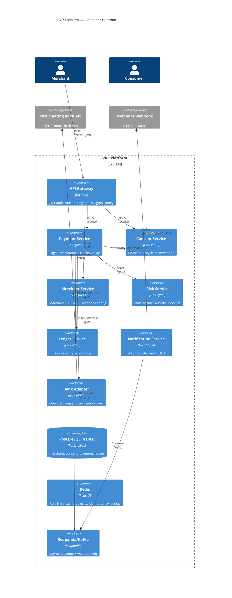
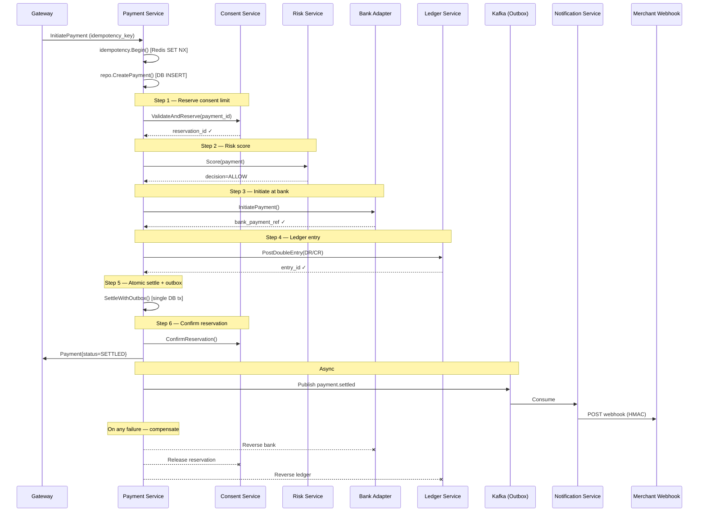

# Variable Recurring Payments (VRP) in Go: Building a One-Click Pay-by-Bank Platform

> A deep technical dive into the UK's VRP ecosystem and a production-grade Go microservices implementation.
>
> **Code:** [github.com/netologist/vrp-oneclick-deposit-platform](https://github.com/netologist/vrp-oneclick-deposit-platform)

---

## Table of Contents

1. [The Problem: Why Every Payment Needs a Red Flag](#1-the-problem-why-every-payment-needs-a-red-flag)
2. [What Is a Variable Recurring Payment?](#2-what-is-a-variable-recurring-payment)
3. [The Consent: A Parameterized Contract](#3-the-consent-a-parameterized-contract)
4. [When Did the UK Switch to VRP? A Timeline](#4-when-did-the-uk-switch-to-vrp-a-timeline)
5. [Sweeping vs Commercial VRP](#5-sweeping-vs-commercial-vrp)
6. [Why Go for Financial Infrastructure?](#6-why-go-for-financial-infrastructure)
7. [The Architecture: 8 Services, One Saga](#7-the-architecture-8-services-one-saga)
8. [Distributed Systems Patterns in Depth](#8-distributed-systems-patterns-in-depth)
9. [Financial Integrity: The Double-Entry Ledger](#9-financial-integrity-the-double-entry-ledger)
10. [Running It Locally](#10-running-it-locally)
11. [Production Hardening: What the Demo Deliberately Skips](#11-production-hardening-what-the-demo-deliberately-skips)
12. [Conclusion](#12-conclusion)

---

## 1. The Problem: Why Every Payment Needs a Red Flag

For decades, online payments were built on a paradox: **the cheapest payment rails are the least trustworthy, and the most trustworthy are the most expensive.**

- **Card-on-file** — Fast and familiar, but the merchant stores card numbers (PCI-DSS burden), interchange fees eat 1–3% of every transaction, and cards expire, get stolen, or get reissued.
- **Direct Debit** — Cheap, but slow (3–5 day settlement), coarse-grained (a fixed amount, not variable), and painful to set up. Reversals are asymmetric: the customer can claw back a payment long after it "settled."
- **Standing orders** — Good for fixed rent, useless for a variable shopping basket.
- **Faster Payments (FPS)** — Near-instant, but historically required the payer to authorize each transfer in their own banking app.

The common thread: **every individual payment requires a new round of authentication.** In the EU and UK, that authentication is legally mandated as **Strong Customer Authentication (SCA)** under PSD2 — two of three factors (something you know, have, or are) for every "payment initiation."

SCA made payments safer. It also made them *slower and more annoying*. For a consumer who deposits £50 into a savings or gaming account every week, re-entering Face ID + OTP + a bank-app redirect every single time is friction that directly causes abandoned transactions.

**Variable Recurring Payments (VRP) is the mechanism that lets you authenticate once, then authorize a *series* of payments within pre-agreed limits — with no further interaction.**

---

## 2. What Is a Variable Recurring Payment?

A **VRP** is a long-lived consent that authorizes a **Payment Initiation Service Provider (PISP)** — a regulated fintech or merchant — to pull payments from a customer's bank account **repeatedly and "variably"** (the amount can differ each time), provided each payment stays inside boundaries the customer agreed to upfront.

Think of it as a **standing order with guardrails**:

| Feature | Standing Order | Direct Debit | **VRP** |
|---|---|---|---|
| Amount | Fixed | Fixed or variable | **Variable** (bounded) |
| Setup | Manual, per-bank | Mandate form | Open Banking consent |
| Authentication | Once at setup | None (merchant pulls) | **SCA once at setup**, then none |
| Speed | Bank batch | 3–5 days | **Near-real-time (FPS)** |
| Revocable | Yes | Yes | **Yes, instantly, via PISP or bank app** |
| Limits | No | No | **Yes — hard limits enforced by the bank** |
| Settlement certainty | High | High | **High (bank-initiated push)** |

The crucial word is **variable**. A customer authorizes:

- *"Let this merchant debit up to £200 per transaction, up to £1,000 in any rolling 30 days, for the next 12 months."*

Then the merchant can debit £50 today, £30 tomorrow, £120 next week — **any amount, any frequency, within those bounds** — and every single one settles in seconds with zero user interaction.

This is the "one-click deposit" experience the demo repo implements.

---

## 3. The Consent: A Parameterized Contract

A VRP is not "unlimited money movement." It is a **precise, bank-enforced contract** between the customer, the bank (the Account Servicing Payment Service Provider, or **ASPSP**), and the merchant (the **PISP**).

The Open Banking standard defines these **consent control parameters**:

| Parameter | Meaning | Example |
|---|---|---|
| `MaximumAmount` | Ceiling for any single payment | £200 |
| `PeriodicLimits` | Ceiling over a rolling window | £1,000 / 30 days |
| `MaximumCumulativeNumber` | Max count of payments in a window | 10 / 30 days |
| `PeriodAlignment` | How the window rolls | Calendar month vs rolling |
| `ValidFrom` / `ValidTo` | Consent lifetime | 1 year |
| `CreditorAccount` | The payee — locked, cannot change | Merchant's sort code + account |

**The critical property: the *bank* enforces these limits, not the merchant.** When a PISP sends a payment instruction that would breach a limit, the ASPSP declines it *at the source*. The merchant cannot silently exceed what the customer agreed to. This is fundamentally different from Direct Debit, where the merchant technically holds a blank cheque.

Two more properties matter:

1. **Instant revocation.** The customer can kill the consent at any moment — via the PISP's app *or* directly in their bank's app. The next payment attempt simply fails. (The demo models this: a `REVOKED` consent causes the saga to reject the payment.)

2. **Authentication is front-loaded.** SCA happens *once*, at consent creation, with the full bank-app redirect. Every subsequent payment skips SCA entirely because the consent *is* the standing proof of customer intent.

---

## 4. When Did the UK Switch to VRP? A Timeline

The UK is the global pioneer of VRP, and its rollout happened in two distinct phases — one *mandated*, one *voluntary*.

### Phase 0 — The Regulatory Foundation (2016–2018)

- **2016:** The Competition and Markets Authority (CMA) published its Retail Banking Market Investigation Order, concluding that the nine largest UK banking groups (the **CMA9**) held an uncompetitive stranglehold on customer data and payment infrastructure.
- **2018:** The CMA9 were ordered to implement an **Open Banking API** — the *Read/Write API* — through the **Open Banking Implementation Entity (OBIE)**, later renamed **Open Banking Limited (OBL)**.

The **CMA9** are:

1. AIB Group (UK)
2. Bank of Ireland (UK)
3. Barclays
4. Danske Bank
5. HSBC Group (incl. First Direct, M&S Bank)
6. Lloyds Banking Group (incl. Bank of Scotland, Halifax)
7. Nationwide Building Society
8. NatWest Group (incl. RBS, Ulster Bank NI)
9. Santander UK

### Phase 1 — The Sweeping Mandate (2021–2024)

VRP first entered the standard in **OBL Read/Write API v3.1.8**, but the CMA deliberately scoped its initial mandate narrowly to **"sweeping"** — moving money *between a customer's own accounts* (e.g., auto-topping a savings pot from a current account). "Me-to-me" transfers are low-risk because the payer and payee are the same person, so fraud incentives are minimal.

- **July 2022:** The original deadline for the CMA9 to ship VRP-for-sweeping.
- **2022–2024:** A staggered *Managed Roll Out (MRO)*, with each bank going live under OBL supervision.
- **September 2024:** The mandate was declared **fully complete** — the final two holdouts, Allied Irish Bank and Bank of Ireland, exited MRO. All CMA9 banks now offer VRP sweeping.

Crucially, the CMA9 remain under a *continuing obligation* from the Retail Banking Market Investigation Order 2017 to keep these sweeping APIs live and functional — this isn't a "ship it and forget it" mandate.

### Phase 2 — Commercial VRP (2026–present)

Sweeping was only ever the warm-up. The economically interesting use case is **Commercial VRP (cVRP)** — payments *to businesses* (utility bills, subscriptions, e-commerce, and the "one-click deposit" this repo demonstrates). Unlike sweeping, cVRP participation is **voluntary** for banks, which meant years of slow, bank-by-bank negotiations with no standardized commercial model.

That changed in 2026:

- **February 2026:** The **UK Payments Forward Plan** positioned VRP as a core pillar of the UK's payment future, alongside the New Payments Architecture.
- **June 2, 2026:** Commercial VRP went live under the **UK Payments Initiative (UKPI)** — an independent, industry-owned body founded by **31 firms** (banks, fintechs, payment providers) providing a **single rulebook and commercial model**. This removed the biggest adoption barrier: the need to negotiate bespoke terms with each bank.

**The bottom line:** the UK "switched to VRP" in two steps — *mandated sweeping VRP by July 2022 (complete by September 2024)*, and *voluntary commercial VRP from June 2026*. The system is now transitioning from the mandated phase into a commercial phase where VRP is positioned to directly compete with Direct Debits and card-on-file.

---

## 5. Sweeping vs Commercial VRP

| Feature | Sweeping VRP ("me-to-me") | Commercial VRP (cVRP) |
|---|---|---|
| **Status** | Mandated, fully implemented | Voluntary, live since June 2026 |
| **Goal** | Move money between own accounts | Pay businesses/merchants |
| **Governance** | CMA Order (OBL monitored) | UK Payments Initiative (UKPI) |
| **Commercial model** | Free (mandated) | Industry-standard, negotiated |
| **Fraud risk** | Low (payer = payee) | Higher (third-party payee) |
| **Use cases** | Savings pots, overdraft shuffling | Subscriptions, deposits, bills |

This repo models the **commercial** flavor: a merchant pulling a consumer's funds against a consented limit.

---

## 6. Why Go for Financial Infrastructure?

Go isn't the *only* language you can build a payments platform in — but it is arguably the *most fitting* for the workload profile. Financial transaction systems are:

1. **Concurrency-heavy** — thousands of payments in flight, each a small state machine.
2. **Latency-sensitive** — the demo targets P99 < 500ms for a full 6-service saga.
3. **Long-lived and low-memory-churn** — a payment service runs for months without restart; GC pauses matter.
4. **Built from many small, independent services** — which favors a language with cheap, fast compilation and static binaries.

Go delivers:

- **Goroutines + channels** — model a payment as a lightweight goroutine; a single service handles tens of thousands of concurrent sagas with trivial memory overhead.
- **Static typing + compile-time safety** — the compiler catches the entire protobuf/gRPC contract mismatch at build time, before money moves.
- **`context.Context`** — a first-class idiom for deadline, cancellation, and tracing propagation that threads through every gRPC call, DB query, and Kafka publish. This *is* distributed tracing, baked into the language.
- **A rich stdlib for the hard parts** — `net/http`, `crypto/hmac`, `crypto/subtle`, `encoding/json`, and (since Go 1.21) `log/slog` for structured logging.
- **Static binaries + tiny containers** — the demo ships in `gcr.io/distroless/static-debian12:nonroot` — a container with *no shell*, *no package manager*, and a dramatically reduced attack surface.
- **A concurrency model that makes "exactly-once" *thinkable*** — you can't hand-write a correct distributed lock in a language without memory guarantees. Go's `sync` + `atomic` primitives, plus the discipline of `-race`, make the invariants explicit.

The repo leans on Go idioms throughout: `signal.NotifyContext` for graceful shutdown, `errors.Is`/`errors.As` for a typed error hierarchy, table-driven tests, and small interfaces (`paymentRepo`, `querier`) for testability.

---

## 7. The Architecture: 8 Services, One Saga

The repo is a Go workspace (`go.work`) with **eight microservices**, a generated protobuf module (`gen/`), and a shared library (`pkg/shared/`).



### The Six-Step Payment Saga

The core of the system is a **saga orchestrator** in `payment-svc`. When a consumer clicks "Deposit £50", the following happens, each step guarded and *compensatable*:

```
Consent → Risk → Bank → Ledger → Settle+Outbox → Confirm
```



### Why a Saga?

A payment touches **four different systems** (consent DB, bank API, ledger DB, event bus) — it is a **distributed transaction**. There is no single atomic commit across a PostgreSQL table, a bank's HTTP API, and a Kafka topic. A **saga** breaks the transaction into local steps, each with a **compensating action**:

| Step | Success | Compensation (on later failure) |
|---|---|---|
| Consent reserve | reservation held | Release reservation |
| Bank initiate | funds moving | Reverse bank payment |
| Ledger post | double-entry written | Reverse ledger entry |
| Settle + outbox | status = SETTLED | (terminal — no compensation needed) |

The repo's `compensate()` correctly collects *all* compensation errors (it doesn't short-circuit) so every rollback is attempted, and escalates to a terminal `MANUAL_REVIEW` state when compensation itself fails — the correct behaviour for money movement.

---

## 8. Distributed Systems Patterns in Depth

This is where the repo earns its "production-grade" label. It implements, correctly, the handful of patterns that separate a *demo* from a *real* payment system.

### 8.1 Transactional Outbox (Solving the Dual-Write Problem)

**The problem:** "Mark payment settled in Postgres" and "publish a Kafka event" are two different systems. If you write the DB row *then* publish the event, a crash between the two leaves a settled payment with **no event** (the merchant never gets their webhook). If you publish *then* write, a crash leaves an event for a payment that doesn't exist.

**The solution:** write the event **into the same database transaction** as the state change, then have a background relay publish it.

```go
// payment-svc/internal/repo.go — SettleWithOutbox
func (r *Repo) SettleWithOutbox(ctx context.Context, p *Payment) error {
    return pgx.BeginFunc(ctx, r.pool, func(tx pgx.Tx) error {
        // 1. UPDATE payment SET status = 'SETTLED'
        // 2. INSERT payment_event (audit log)
        // 3. INSERT outbox (topic, key, payload)   ← same transaction
        // All three commit atomically or not at all.
        return nil
    })
}
```

A relay goroutine polls the `outbox` table every 200ms, publishes each row to Kafka, and deletes it after a synchronous ack — **at-least-once** delivery semantics.

### 8.2 Idempotency (Exactly-Once for Money)

"Exactly-once" doesn't exist on a network. What exists is **at-least-once delivery + idempotent processing**. The repo enforces idempotency at *three* layers:

1. **Redis `SET NX`** — the first caller to claim an idempotency key "wins"; concurrent duplicates get the existing result.
2. **Database unique constraint** — `payment_id` is unique; a duplicate insert is caught and mapped to `CodeDuplicateIdempotency`, which re-reads and returns the original.
3. **Consumer dedup** — the notification service keeps a 24h Redis key per `payment_id`, so a redelivered Kafka message doesn't fire the webhook twice.

```go
// pkg/shared/idempotency/redis.go — atomic claim
func (s *Store) Begin(ctx context.Context, idemKey string) (bool, error) {
    ok, err := s.rdb.SetNX(ctx, key(idemKey), "PROCESSING", s.ttl).Result()
    // ...
}
```

### 8.3 Circuit Breaker + Retry

The bank is an external dependency you can't control. When it fails, the worst thing you can do is hammer it and cascade the failure. `bank-adapter` wraps every outbound call in a **circuit breaker** (gobreaker) *and* a **bounded exponential retry** (retry-go):

```go
// bank-adapter/internal/adapter.go
// gobreaker: 10 consecutive failures → open circuit
//            10s half-open probe, max 5 half-open requests
// retry-go:  3 attempts, 100ms exponential backoff, RetryIf=isTransient
```

`transientError` distinguishes a *retriable* failure (HTTP 5xx — the bank is down) from a *non-retriable* one (a 4xx business rejection — retrying won't help). This distinction is what keeps retries from amplifying a real rejection into a thundering herd.

### 8.4 Pessimistic vs Optimistic Concurrency

- **Pessimistic** (`SELECT ... FOR UPDATE`): the consent service locks the consent row while it checks rolling 30-day limits and reserves the new payment — *no two concurrent payments can both pass the limit check*.
- **Optimistic** (`ON CONFLICT DO NOTHING`, CAS with `WHERE status = $old`): the ledger and retry logic use compare-and-swap so a stale write fails cleanly.

### 8.5 Idempotent Consumer + Dead Letter Queue

The notification service consumes `payment.events` with **at-least-once** semantics and manual offset commit. A poison message (invalid JSON) is *skipped and logged* rather than retried forever. Failed deliveries go to a **DLQ topic** (`webhook.dlq`) with the raw bytes preserved as `json.RawMessage` for replay.

### 8.6 Rate Limiting

The gateway applies a per-merchant fixed-window rate limit in Redis. It fails *open* when Redis is down — the correct resilience posture: degraded performance is better than a total outage.

---

## 9. Financial Integrity: The Double-Entry Ledger

This is the most sophisticated part of the repo, and the one most demos get wrong. A payments ledger must be **provably balanced** — every debit has a matching credit, and the sum of all journal lines is always zero.

The `ledger-svc` enforces this at the *database* level, not the application level:

```sql
-- migrations/ledger/000001_init.up.sql
CREATE CONSTRAINT TRIGGER trg_journal_balance
AFTER INSERT OR UPDATE ON journal_line
DEFERRABLE INITIALLY DEFERRED
FOR EACH ROW
EXECUTE FUNCTION check_journal_balance();
```

This trigger rejects any transaction that leaves the ledger unbalanced — **the invariant cannot be violated, even by a buggy application**. The application layer adds:

- **SERIALIZABLE isolation** with retry on serialization failure (`40001`/`40P01`) — two concurrent entries that would corrupt the balance are re-run, not silently committed.
- **Idempotent posting** — posting the same `payment_id` twice returns the existing entry.
- **Reversals** — a reversal entry flips debit↔credit and marks the original reversed, all in one serializable transaction.

```go
// ledger-svc/internal/store.go
func withSerializable(ctx context.Context, pool *pgxpool.Pool, fn func(pgx.Tx) error) error {
    for range maxAttempts { // Go 1.22 range-over-int
        err := pgx.BeginTxFunc(ctx, pool,
            pgx.TxOptions{IsoLevel: pgx.Serializable}, fn)
        if err == nil { return nil }
        if !isSerializationFailure(err) { return err } // only retry 40001/40P01
    }
    return err
}
```

The **`Money` value object** (`pkg/shared/money`) is the quiet hero: it stores amounts as **integer minor units (`int64` pence)** and *never* floats. There is no `float64` arithmetic anywhere near money — the classic source of rounding errors that corrupt ledgers.

```go
type Money struct {
    amountPence int64  // never float64
    currency    string // ISO 4217
}
```

---

## 10. Running It Locally

```bash
# 1) Infra — Postgres, Redis, Redpanda (Kafka), Jaeger, Prometheus, Grafana
make up

# 2) Generate protos (only when .proto changes)
make proto

# 3) Build all 8 services into ./bin
make build

# 4) Run all processes
./scripts/run-all.sh

# 5) End-to-end smoke test: register → JWT → consent → payment SETTLED → webhook
./scripts/e2e-smoke.sh
```

The smoke test exercises the *entire* journey: register a merchant, mint a JWT, create a consent, initiate a payment that runs the full six-step saga to `SETTLED`, and verify the merchant webhook fires.

| Service | Port |
|---|---|
| Gateway (HTTP) | 8080 |
| Merchant gRPC | 50051 |
| Consent gRPC | 50052 |
| Payment gRPC | 50053 |
| Risk gRPC | 50054 |
| Ledger gRPC | 50055 |
| Bank Adapter gRPC | 50056 |
| Mock Bank HTTP | 18080 |

---

## 11. Production Hardening: What the Demo Deliberately Skips

The repo is explicitly an *"interview-grade"* demo. A thorough review surfaces the gaps you'd close before real money flows. Being honest about them is part of the engineering discipline:

| Category | Gap | Production Fix |
|---|---|---|
| **Build** | `go 1.26.2` version directive is fictional | Pin to a real toolchain (1.23.x) |
| **Secrets** | `k8s/secrets.yaml` has plaintext JWT/HMAC | External Secrets Operator + Vault, or SealedSecrets |
| **Webhook** | `webhook.Verify` lacks a timestamp freshness check | Reject signatures older than ~5 min (Stripe-style) |
| **Transport** | `sslmode=disable` on all DB URLs | `verify-full` with a CA in production |
| **Outbox** | `ListOutbox` lacks `FOR UPDATE SKIP LOCKED` | Prevent duplicate events under multi-replica |
| **Kafka** | `RequiredAcks: RequireOne` | `RequireAll` with replication ≥ 2 for financial events |
| **K8s** | No `securityContext`, no gRPC `livenessProbe` | `runAsNonRoot`, `readOnlyRootFilesystem`, `drop: [ALL]` |
| **Tests** | Handler/repo layers ~0% covered | bufconn gRPC tests + testcontainers for the ledger |
| **Error model** | Downstream errors classified via `strings.Contains` | `google.rpc.ErrorInfo` status details |

These aren't hidden flaws — they're the exact list of "what separates a demo from production," and documenting them is itself the point of the exercise.

---

## 12. Conclusion

Variable Recurring Payments represent the most significant change to UK payment rails since Faster Payments: **authenticate once, pay many times, with hard, bank-enforced limits.** The UK led the world — *mandating sweeping VRP by July 2022 (complete September 2024)* and *launching commercial VRP on June 2, 2026* under the UK Payments Initiative.

Building VRP infrastructure is a masterclass in distributed systems: sagas, transactional outboxes, idempotency, circuit breakers, and provable double-entry accounting — all of which Go handles with particular grace thanks to goroutines, `context.Context`, `log/slog`, and static binaries.

The [vrp-oneclick-deposit-platform](https://github.com/netologist/vrp-oneclick-deposit-platform) repo is a rare, runnable reference that gets the hard 20% right: the saga compensation matrix, the outbox atomicity, the SERIALIZABLE ledger, and layered idempotency. If you're learning Go or distributed systems, it's an excellent codebase to read, critique, and — as a next step — harden.

---

*This post references the open-source project [github.com/netologist/vrp-oneclick-deposit-platform](https://github.com/netologist/vrp-oneclick-deposit-platform). VRP regulatory facts verified against CMA/OBL/UKPI sources, current as of 2026.*
