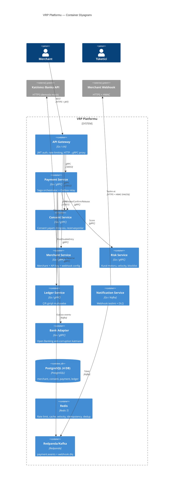

# Go ile Variable Recurring Payments (VRP): Tek Tıkla Pay-by-Bank Platformu İnşa Etmek

> İngiltere'nin VRP ekosistemine ve production-seviyesi bir Go mikroservis uygulamasına derin teknik bakış.
>
> **Kod:** [github.com/netologist/vrp-oneclick-deposit-platform](https://github.com/netologist/vrp-oneclick-deposit-platform)

---

## İçindekiler

1. [Problem: Neden Her Ödemede Yeniden Kimlik Doğrulaması?](#1-problem-neden-her-ödemede-yeniden-kimlik-doğrulaması)
2. [Variable Recurring Payment Nedir?](#2-variable-recurring-payment-nedir)
3. [Consent: Parametrelendirilmiş Bir Sözleşme](#3-consent-parametrelendirilmiş-bir-sözleşme)
4. [İngiltere VRP'ye Ne Zaman Geçti? Zaman Çizelgesi](#4-i̇ngiltere-vrpye-ne-zaman-geçti-zaman-çizelgesi)
5. [Sweeping vs Commercial VRP](#5-sweeping-vs-commercial-vrp)
6. [Finansal Altyapı İçin Neden Go?](#6-finansal-altyapı-i̇çin-neden-go)
7. [Mimari: 8 Servis, Tek Saga](#7-mimari-8-servis-tek-saga)
8. [Dağıtık Sistem Kalıpları Derinlemesine](#8-dağıtık-sistem-kalıpları-derinlemesine)
9. [Finansal Bütünlük: Çift Girişli Muhasebe](#9-finansal-bütünlük-çift-girişli-muhasebe)
10. [Lokalde Çalıştırma](#10-lokalde-çalıştırma)
11. [Production'a Hazırlama: Demo'nun Bilinçli Olarak Atladıkları](#11-productiona-hazırlama-demonun-bilinçli-olarak-atladıkları)
12. [Sonuç](#12-sonuç)

---

## 1. Problem: Neden Her Ödemede Yeniden Kimlik Doğrulaması?

Yıllar boyunca çevrimiçi ödemeler bir paradoks üzerine kuruluydu: **en ucuz ödeme altyapıları en az güvenilir, en güvenilirleri ise en pahalıydı.**

- **Card-on-file** — Hızlı ve tanıdık ama merchant kart numarasını saklar (PCI-DSS yükü), interchange ücretleri her işlemde %1–3 yer, kartlar süresi dolar, çalınır veya yeniden basılır.
- **Direct Debit** — Ucuz ama yavaş (3–5 gün mutabakat), kaba taneli (değişken değil sabit tutar) ve kurulumu zahmetli. Geri almalar asimetrik: müşteri, ödeme "tamamlandı" dedikten çok sonra bile parayı geri çekebilir.
- **Standing order** — Sabit kira için iyi, değişken bir alışveriş sepeti için işe yaramaz.
- **Faster Payments (FPS)** — Neredeyse anlık, ama tarihsel olarak ödeyenin her transferi kendi bankacılık uygulamasında onaylamasını gerektirirdi.

Ortak nokta: **her bireysel ödeme yeni bir kimlik doğrulama turu gerektirir.** AB ve İngiltere'de bu doğrulama, PSD2 kapsamında **Strong Customer Authentication (SCA)** olarak yasal zorunluluktur — her "ödeme başlatma" için üç faktörden ikisi (bildiğin, sahip olduğun veya olduğun şey).

SCA ödemeleri güvenli yaptı. Aynı zamanda onları *yavaş ve sinir bozucu* hale getirdi. Her hafta hesabına £50 yatıran bir tüketici için her seferinde Face ID + OTP + banka uygulamasına yönlendirme yeniden girmek, doğrudan terk edilen işlemlere neden olan sürtünmedir.

**Variable Recurring Payments (VRP), bir kez kimlik doğrulayıp sonrasında önceden anlaşılmış limitler dahilinde bir *seri* ödemeyi — başka hiçbir etkileşim olmadan — yetkilendirmenizi sağlayan mekanizmadır.**

---

## 2. Variable Recurring Payment Nedir?

Bir **VRP**, **Payment Initiation Service Provider (PISP)**'ın — düzenlenmiş bir fintech veya merchant'ın — müşterinin banka hesabından **tekrar tekrar ve "değişken" şekilde** (tutar her seferinde farklı olabilir) ödeme çekmesine izin veren, her ödemenin müşterinin önceden kabul ettiği sınırlar içinde kalması koşuluyla tanınan uzun ömürlü bir yetkidir.

Bunu **korkuluklu bir standing order** gibi düşünün:

| Özellik | Standing Order | Direct Debit | **VRP** |
|---|---|---|---|
| Tutar | Sabit | Sabit veya değişken | **Değişken** (sınırlı) |
| Kurulum | Manuel, banka başına | Mandate formu | Open Banking consent |
| Kimlik doğrulama | Kurulumda bir kez | Yok (merchant çeker) | **Kurulumda bir kez SCA**, sonra yok |
| Hız | Banka toplu işlemi | 3–5 gün | **Yakın gerçek zamanlı (FPS)** |
| İptal edilebilir | Evet | Evet | **Evet, anında, PISP veya banka uygulamasından** |
| Limitler | Hayır | Hayır | **Evet — banka tarafından uygulanan sert limitler** |
| Mutabakat kesinliği | Yüksek | Yüksek | **Yüksek (banka kaynaklı push)** |

Kritik kelime **değişken**. Müşteri şunu yetkilendirir:

- *"Bu merchant, işlem başına £200'e, herhangi bir 30 günlük pencere içinde toplam £1.000'e kadar, önümüzdeki 12 ay boyunca hesabımdan para çekebilsin."*

Sonra merchant bugün £50, yarın £30, gelecek hafta £120 çekebilir — **bu sınırlar içinde herhangi bir tutar, herhangi bir sıklıkta** — ve her biri sıfır kullanıcı etkileşimiyle saniyeler içinde gerçekleşir.

Demo repo'nun uyguladığı "tek tıkla para yatırma" deneyimi budur.

---

## 3. Consent: Parametrelendirilmiş Bir Sözleşme

Bir VRP "sınırsız para hareketi" değildir. Müşteri, banka (Account Servicing Payment Service Provider, yani **ASPSP**) ve merchant (**PISP**) arasında **hassas, banka tarafından uygulanan bir sözleşmedir**.

Open Banking standardı şu **consent kontrol parametrelerini** tanımlar:

| Parametre | Anlam | Örnek |
|---|---|---|
| `MaximumAmount` | Tek ödeme için tavan | £200 |
| `PeriodicLimits` | Kayan pencere içinde tavan | £1.000 / 30 gün |
| `MaximumCumulativeNumber` | Pencere içinde maks. ödeme sayısı | 10 / 30 gün |
| `PeriodAlignment` | Pencerenin nasıl kaydığı | Takvim ayı vs kayan |
| `ValidFrom` / `ValidTo` | Consent ömrü | 1 yıl |
| `CreditorAccount` | Alacaklı — kilitli, değiştirilemez | Merchant'ın sort code + hesabı |

**Kritik özellik: bu limitleri *banka* uygular, merchant değil.** Bir PISP, bir limiti aşacak bir ödeme talimatı gönderdiğinde, ASPSP bunu *kaynağında* reddeder. Merchant, müşterinin kabul ettiğini sessizce aşamaz. Bu, merchant'ın teknik olarak açık bir çek tuttuğu Direct Debit'ten temelden farklıdır.

İki özellik daha önemlidir:

1. **Anında iptal.** Müşteri yetkiyi her an öldürebilir — PISP'nin uygulamasından *veya* doğrudan bankasının uygulamasından. Sonraki ödeme denemesi basitçe başarısız olur. (Demo bunu modelliyor: `REVOKED` bir consent, saga'nın ödemeyi reddetmesine neden olur.)

2. **Kimlik doğrulama öne alınır.** SCA *bir kez*, consent oluşturulurken, tam banka uygulaması yönlendirmesiyle gerçekleşir. Sonraki her ödeme SCA'yı tamamen atlar çünkü consent, müşteri niyetinin kalıcı kanıtıdır.

---

## 4. İngiltere VRP'ye Ne Zaman Geçti? Zaman Çizelgesi

İngiltere, VRP'nin küresel öncüsüdür ve geçişi iki farklı aşamada gerçekleşti — biri *zorunlu*, biri *gönüllü*.

### Aşama 0 — Düzenleyici Temel (2016–2018)

- **2016:** Competition and Markets Authority (CMA), Retail Banking Market Investigation Order'ı yayımladı; Birleşik Krallık'ın en büyük dokuz bankacılık grubunun ( **CMA9**) müşteri verisi ve ödeme altyapısı üzerinde rekabeti bozan bir boğuculuğa sahip olduğu sonucuna vardı.
- **2018:** CMA9'a, **Open Banking Implementation Entity (OBIE)** — sonradan **Open Banking Limited (OBL)** — aracılığıyla *Read/Write API* adlı bir **Open Banking API**'si uygulamaları emredildi.

**CMA9** şunlardır:

1. AIB Group (UK)
2. Bank of Ireland (UK)
3. Barclays
4. Danske Bank
5. HSBC Group (First Direct, M&S Bank dahil)
6. Lloyds Banking Group (Bank of Scotland, Halifax dahil)
7. Nationwide Building Society
8. NatWest Group (RBS, Ulster Bank NI dahil)
9. Santander UK

### Aşama 1 — Sweeping Zorunluluğu (2021–2024)

VRP, standarda ilk olarak **OBL Read/Write API v3.1.8** ile girdi, ancak CMA başlangıçtaki zorunluluğunu bilinçli olarak **"sweeping"** ile sınırladı — müşterinin *kendi hesapları arasında* para taşıma (ör. vadesiz hesaptan birikim hesabına otomatik aktarma). "Me-to-me" transferler düşük risklidir çünkü ödeyen ve alacaklı aynı kişidir, dolayısıyla dolandırıcılık teşvikleri minimumdur.

- **Temmuz 2022:** CMA9'un VRP-for-sweeping'i teslim etmesi için orijinal son tarih.
- **2022–2024:** OBL gözetiminde her bankanın canlıya geçtiği kademeli bir *Managed Roll Out (MRO)*.
- **Eylül 2024:** Zorunluluk **tamamen tamamlandı** ilan edildi — son iki tutunucu, Allied Irish Bank ve Bank of Ireland, MRO'dan çıktı. Tüm CMA9 bankaları artık VRP sweeping sunuyor.

Kritik olarak, CMA9, Retail Banking Market Investigation Order 2017'den kaynaklanan *sürekli bir yükümlülük* altında kalmaya devam ediyor: bu sweeping API'lerini canlı ve işlevsel tutmak zorundalar — bu "gönder ve unut" bir zorunluluk değil.

### Aşama 2 — Commercial VRP (2026–günümüz)

Sweeping yalnızca ısınma turuydu. Ekonomik olarak ilginç kullanım alanı **Commercial VRP (cVRP)** — işletmelere yapılan ödemeler (faturalar, abonelikler, e-ticaret ve bu repo'nun gösterdiği "tek tıkla para yatırma"). Sweeping'in aksine, cVRP katılımı bankalar için **gönüllüdür**; bu da yıllarca süren, standart bir ticari model olmayan banka-banka müzakerelere yol açtı.

Bu durum 2026'da değişti:

- **Şubat 2026:** **UK Payments Forward Plan**, VRP'yi New Payments Architecture ile birlikte Birleşik Krallık ödeme geleceğinin temel bir direği olarak konumlandırdı.
- **2 Haziran 2026:** Commercial VRP, **31 firma** (bankalar, fintech'ler, ödeme sağlayıcıları) tarafından kurulan bağımsız, sektöre ait bir kuruluş olan **UK Payments Initiative (UKPI)** altında canlıya geçti; **tek bir rulebook ve ticari model** sağlıyor. Bu, en büyük benimseme engelini kaldırdı: her bankayla özel koşullar müzakere etme zorunluluğu.

**Özet:** İngiltere, VRP'ye iki adımda geçti — *Temmuz 2022'ye kadar zorunlu sweeping VRP (Eylül 2024'te tamamlandı)* ve *Haziran 2026'dan itibaren gönüllü commercial VRP*. Sistem şimdi zorunlu aşamadan, VRP'nin Direct Debit ve card-on-file ile doğrudan rekabet edeceği ticari aşamaya geçiyor.

---

## 5. Sweeping vs Commercial VRP

| Özellik | Sweeping VRP ("me-to-me") | Commercial VRP (cVRP) |
|---|---|---|
| **Durum** | Zorunlu, tamamen uygulandı | Gönüllü, Haziran 2026'dan beri canlı |
| **Amaç** | Kendi hesaplar arasında para taşıma | İşletmelere/merchant'lara ödeme |
| **Yönetişim** | CMA Order (OBL izler) | UK Payments Initiative (UKPI) |
| **Ticari model** | Ücretsiz (zorunlu) | Sektör standardı, müzakere edilir |
| **Dolandırıcılık riski** | Düşük (ödeyen = alacaklı) | Yüksek (üçüncü taraf alacaklı) |
| **Kullanım alanları** | Birikim hesapları, overdraft | Abonelikler, para yatırma, faturalar |

Bu repo **commercial** çeşidi modelliyor: bir merchant, consent edilmiş bir limite karşı tüketicinin parasını çekiyor.

---

## 6. Finansal Altyapı İçin Neden Go?

Go, ödeme platformu inşa edebileceğiniz *tek* dil değil — ama bu iş yükü profili için tartışmasız *en uygun* olanı. Finansal işlem sistemleri şunlardır:

1. **Concurrency yoğun** — aynı anda binlerce ödeme, her biri küçük bir state machine.
2. **Gecikmeye duyarlı** — demo, tam 6 servislik bir saga için P99 < 500ms hedefliyor.
3. **Uzun ömürlü ve düşük bellek churn'ü** — bir ödeme servisi yeniden başlatılmadan aylarca çalışır; GC duraklamaları önemlidir.
4. **Birçok küçük, bağımsız servisten oluşur** — bu da ucuz, hızlı derleme ve statik binary'leri olan bir dili tercih ettirir.

Go şunları sunar:

- **Goroutine + channel** — bir ödemeyi hafif bir goroutine olarak modelleyin; tek bir servis, önemsiz bellek yüküyle on binlerce eşzamanlı saga'yı yönetir.
- **Statik tip + compile-time güvenlik** — derleyici, para hareket etmeden önce tüm protobuf/gRPC sözleşme uyumsuzluklarını build zamanında yakalar.
- **`context.Context`** — her gRPC çağrısı, DB sorgusu ve Kafka publish'inden geçen deadline, cancellation ve tracing yayılımı için birinci sınıf bir deyim. Bu, dile gömülü dağıtık izlemedir.
- **Zor kısımlar için zengin stdlib** — `net/http`, `crypto/hmac`, `crypto/subtle`, `encoding/json` ve (Go 1.21'den beri) yapılandırılmış loglama için `log/slog`.
- **Statik binary + küçük container** — demo, `gcr.io/distroless/static-debian12:nonroot` içinde dağıtılır: *shell'siz*, *paket yöneticisiz* ve önemli ölçüde azaltılmış saldırı yüzeyi.
- **"Exactly-once"ı *düşünülebilir* kılan bir concurrency modeli** — bellek garantisi olmayan bir dilde doğru bir dağıtık kilit elle yazamazsınız. Go'nun `sync` + `atomic` ilkelleri ve `-race` disiplini, invariantları açık hale getirir.

Repo, Go deyimlerine baştan sona yaslanır: graceful shutdown için `signal.NotifyContext`, tipli hata hiyerarşisi için `errors.Is`/`errors.As`, table-driven testler ve test edilebilirlik için küçük interface'ler (`paymentRepo`, `querier`).

---

## 7. Mimari: 8 Servis, Tek Saga

Repo, **sekiz mikroservis**, üretilmiş bir protobuf modülü (`gen/`) ve paylaşılan bir kütüphane (`pkg/shared/`) içeren bir Go workspace'idir (`go.work`).



### Altı Adımlı Ödeme Saga'sı

Sistemin çekirdeği, `payment-svc` içindeki bir **saga orchestrator**'dır. Tüketici "£50 Yatır"a tıkladığında, her adım korumalı ve *telafi edilebilir* şekilde şunlar gerçekleşir:

```
Consent → Risk → Banka → Ledger → Settle+Outbox → Confirm
```


### Neden Saga?

Bir ödeme **dört farklı sisteme** dokunur (consent DB, banka API'si, ledger DB, event bus) — bu bir **dağıtık transaction**'dır. Bir PostgreSQL tablosu, bir bankanın HTTP API'si ve bir Kafka topic'i arasında tek bir atomik commit yoktur. Bir **saga**, transaction'ı her biri **telafi edici bir aksiyona** sahip yerel adımlara böler:

| Adım | Başarı | Telafi (sonraki hata durumunda) |
|---|---|---|
| Consent rezerve | rezervasyon tutuldu | Rezervasyonu serbest bırak |
| Banka başlat | para hareket ediyor | Banka ödemesini geri al |
| Ledger kaydet | çift giriş yazıldı | Muhasebe kaydını tersine çevir |
| Settle + outbox | status = SETTLED | (terminal — telafi gerekmez) |

Repo'nun `compensate()` fonksiyonu, tüm telafi hatalarını doğru şekilde *toplar* (short-circuit yapmaz), böylece her rollback denenir; telafinin kendisi başarısız olduğunda ise terminal bir `MANUAL_REVIEW` durumuna yükseltir — para hareketi için doğru davranış.

---

## 8. Dağıtık Sistem Kalıpları Derinlemesine

Repo'nun "production-grade" etiketini hak ettiği yer burasıdır. Bir *demo*'yu *gerçek* bir ödeme sisteminden ayıran az sayıdaki kalıbı doğru şekilde uygular.

### 8.1 Transactional Outbox (Dual-Write Problemini Çözme)

**Problem:** "Ödemeyi Postgres'te settled yap" ve "Kafka event yayınla" iki farklı sistemdir. DB satırını *sonra* event'i yazarsanız, ikisi arasında bir çökme, **event'siz settled bir ödeme** bırakır (merchant webhook'unu asla almaz). Önce yayınlayıp *sonra* yazarsanız, çökme var olmayan bir ödeme için event bırakır.

**Çözüm:** event'i, durum değişikliğiyle **aynı veritabanı transaction'ına** yazın, sonra arka plandaki bir relay onu yayınlasın.

```go
// payment-svc/internal/repo.go — SettleWithOutbox
func (r *Repo) SettleWithOutbox(ctx context.Context, p *Payment) error {
    return pgx.BeginFunc(ctx, r.pool, func(tx pgx.Tx) error {
        // 1. UPDATE payment SET status = 'SETTLED'
        // 2. INSERT payment_event (audit log)
        // 3. INSERT outbox (topic, key, payload)   ← aynı transaction
        // Üçü birlikte atomik commit olur ya da hiçbiri olmaz.
        return nil
    })
}
```

Bir relay goroutine'i `outbox` tablosunu 200ms'de bir poll eder, her satırı Kafka'ya yayınlar ve senkron ack sonrası siler — **at-least-once** teslim semantiği.

### 8.2 Idempotency (Para İçin Exactly-Once)

"Exactly-once" bir ağ üzerinde mevcut değildir. Var olan şey **at-least-once teslim + idempotent işleme**dir. Repo, idempotency'yi *üç* katmanda uygular:

1. **Redis `SET NX`** — bir idempotency anahtarını ilk talep eden "kazanır"; eşzamanlı duplikatlar mevcut sonucu alır.
2. **Veritabanı unique constraint** — `payment_id` benzersizdir; duplikat insert yakalanır ve `CodeDuplicateIdempotency`'ye eşlenir, orijinali yeniden okur ve döndürür.
3. **Consumer dedup** — notification servisi, `payment_id` başına 24 saatlik bir Redis anahtarı tutar; böylece yeniden teslim edilen bir Kafka mesajı webhook'u iki kez tetiklemez.

```go
// pkg/shared/idempotency/redis.go — atomik claim
func (s *Store) Begin(ctx context.Context, idemKey string) (bool, error) {
    ok, err := s.rdb.SetNX(ctx, key(idemKey), "PROCESSING", s.ttl).Result()
    // ...
}
```

### 8.3 Circuit Breaker + Retry

Banka, kontrol edemediğiniz bir dış bağımlılıktır. Başarısız olduğunda yapılacak en kötü şey, onu dövmek ve hatayı kademelendirmektir. `bank-adapter`, her dış çağrıyı bir **circuit breaker** (gobreaker) *ve* **sınırlı exponential retry** (retry-go) ile sarar:

```go
// bank-adapter/internal/adapter.go
// gobreaker: 10 ardışık başarısızlık → devre açık
//            10s half-open probe, maks 5 half-open istek
// retry-go:  3 deneme, 100ms exponential backoff, RetryIf=isTransient
```

`transientError`, *yeniden denenebilir* bir hatayı (HTTP 5xx — banka kapalı) *yeniden denenemez* olandan (4xx business reddi — yeniden denemek fayda etmez) ayırır. Bu ayrım, retry'lerin gerçek bir reddi bir thundering herd'e dönüştürmesini engeller.

### 8.4 Pessimistic vs Optimistic Concurrency

- **Pessimistic** (`SELECT ... FOR UPDATE`): consent servisi, kayan 30 günlük limitleri kontrol edip yeni ödemeyi rezerve ederken consent satırını kilitler — *iki eşzamanlı ödeme limit kontrolünü aynı anda geçemez*.
- **Optimistic** (`ON CONFLICT DO NOTHING`, `WHERE status = $old` ile CAS): ledger ve retry mantığı, bayat bir yazımın temiz şekilde başarısız olması için compare-and-swap kullanır.

### 8.5 Idempotent Consumer + Dead Letter Queue

Notification servisi, `payment.events`'i **at-least-once** semantiği ve manuel offset commit ile tüketir. Bir poison mesajı (geçersiz JSON), sonsuza dek yeniden denemek yerine *atlanır ve loglanır*. Başarısız teslimatlar, replay için ham baytları `json.RawMessage` olarak koruyan bir **DLQ topic**'ine (`webhook.dlq`) gider.

### 8.6 Rate Limiting

Gateway, Redis'te merchant başına fixed-window bir rate limit uygular. Redis kapalıyken *fail-open* davranır — doğru resilience duruşu: bozulmuş performans, tam bir kesintiden iyidir.

---

## 9. Finansal Bütünlük: Çift Girişli Muhasebe

Bu, repo'nun en sofistike kısmıdır ve çoğu demo'nun yanlış yaptığı kısımdır. Bir ödeme ledger'ı **kanıtlanabilir şekilde dengeli** olmalıdır — her borcun eşleşen bir alacağı vardır ve tüm journal satırlarının toplamı her zaman sıfırdır.

`ledger-svc` bunu uygulama katmanında değil, *veritabanı* katmanında uygular:

```sql
-- migrations/ledger/000001_init.up.sql
CREATE CONSTRAINT TRIGGER trg_journal_balance
AFTER INSERT OR UPDATE ON journal_line
DEFERRABLE INITIALLY DEFERRED
FOR EACH ROW
EXECUTE FUNCTION check_journal_balance();
```

Bu trigger, ledger'ı dengesiz bırakan her transaction'ı reddeder — **invariant, hatalı bir uygulama tarafından bile ihlal edilemez.** Uygulama katmanı şunları ekler:

- **SERIALIZABLE isolation** + serialization failure'da retry (`40001`/`40P01`) — bakiyeyi bozacak iki eşzamanlı kayıt, sessizce commit edilmek yerine yeniden çalıştırılır.
- **Idempotent posting** — aynı `payment_id`'yi iki kez kaydetmek mevcut kaydı döndürür.
- **Reversals** — bir reversal kaydı borç↔alacağı çevirir ve orijinali reversed işaretler; hepsi tek bir serializable transaction'da.

```go
// ledger-svc/internal/store.go
func withSerializable(ctx context.Context, pool *pgxpool.Pool, fn func(pgx.Tx) error) error {
    for range maxAttempts { // Go 1.22 range-over-int
        err := pgx.BeginTxFunc(ctx, pool,
            pgx.TxOptions{IsoLevel: pgx.Serializable}, fn)
        if err == nil { return nil }
        if !isSerializationFailure(err) { return err } // sadece 40001/40P01 retry
    }
    return err
}
```

**`Money` value object'i** (`pkg/shared/money`) sessiz kahramandır: tutarları **tamsayı küçük birimler (`int64` pence)** olarak saklar ve *asla* float kullanmaz. Paranın yakınında hiçbir `float64` aritmetiği yoktur — ledger'ları bozan klasik yuvarlama hatası kaynağı.

```go
type Money struct {
    amountPence int64  // asla float64
    currency    string // ISO 4217
}
```

---

## 10. Lokalde Çalıştırma

```bash
# 1) Altyapı — Postgres, Redis, Redpanda (Kafka), Jaeger, Prometheus, Grafana
make up

# 2) Proto'ları üret (sadece .proto değiştiğinde)
make proto

# 3) 8 servisi ./bin'e derle
make build

# 4) Tüm süreçleri çalıştır
./scripts/run-all.sh

# 5) Uçtan uca smoke test: register → JWT → consent → payment SETTLED → webhook
./scripts/e2e-smoke.sh
```

Smoke test tüm yolculuğu çalıştırır: merchant kaydet, JWT üret, consent oluştur, tam altı adımlık saga'yı `SETTLED`'a koşturan bir ödeme başlat ve merchant webhook'unun tetiklendiğini doğrula.

| Servis | Port |
|---|---|
| Gateway (HTTP) | 8080 |
| Merchant gRPC | 50051 |
| Consent gRPC | 50052 |
| Payment gRPC | 50053 |
| Risk gRPC | 50054 |
| Ledger gRPC | 50055 |
| Bank Adapter gRPC | 50056 |
| Mock Bank HTTP | 18080 |

---

## 11. Production'a Hazırlama: Demo'nun Bilinçli Olarak Atladıkları

Repo açıkça *"interview-grade"* bir demodur. Kapsamlı bir inceleme, gerçek para akmadan önce kapatmanız gereken boşlukları ortaya çıkarır. Bunları dürüstçe söylemek, mühendislik disiplininin bir parçasıdır:

| Kategori | Boşluk | Production Fix |
|---|---|---|
| **Build** | `go 1.26.2` versiyon direktifi hayali | Gerçek bir toolchain'e sabitle (1.23.x) |
| **Secrets** | `k8s/secrets.yaml` plaintext JWT/HMAC | External Secrets Operator + Vault veya SealedSecrets |
| **Webhook** | `webhook.Verify` timestamp freshness kontrolü yok | ~5 dk'dan eski imzaları reddet (Stripe tarzı) |
| **Transport** | Tüm DB URL'lerinde `sslmode=disable` | Production'da CA ile `verify-full` |
| **Outbox** | `ListOutbox` `FOR UPDATE SKIP LOCKED` içermiyor | Multi-replica'da duplike event'leri önle |
| **Kafka** | `RequiredAcks: RequireOne` | Finansal event'ler için replication ≥ 2 ile `RequireAll` |
| **K8s** | `securityContext` yok, gRPC `livenessProbe` yok | `runAsNonRoot`, `readOnlyRootFilesystem`, `drop: [ALL]` |
| **Testler** | Handler/repo katmanları ~%0 kapsam | bufconn gRPC testleri + ledger için testcontainers |
| **Hata modeli** | Downstream hatalar `strings.Contains` ile sınıflanıyor | `google.rpc.ErrorInfo` status details |

Bunlar gizli kusurlar değil — tam olarak "demo'yu production'dan ayıran şey" listesidir ve bunları belgelemek, egzersizin amacıdır.

---

## 12. Sonuç

Variable Recurring Payments, Faster Payments'tan bu yana Birleşik Krallık ödeme altyapısındaki en önemli değişikliği temsil ediyor: **bir kez kimlik doğrula, birçok kez öde, sert ve banka tarafından uygulanan limitlerle.** İngiltere dünyaya öncülük etti — *Temmuz 2022'ye kadar sweeping VRP'yi zorunlu kıldı (Eylül 2024'te tamamlandı)* ve *2 Haziran 2026'da UK Payments Initiative altında commercial VRP'yi başlattı*.

VRP altyapısı inşa etmek bir dağıtık sistemler masterclass'ıdır: sagalar, transactional outbox'lar, idempotency, circuit breaker'lar ve kanıtlanabilir çift girişli muhasebe — bunların hepsini Go, goroutine'ler, `context.Context`, `log/slog` ve statik binary'ler sayesinde özel bir zarafetle yönetir.

[vrp-oneclick-deposit-platform](https://github.com/netologist/vrp-oneclick-deposit-platform) repo'su, zor %20'yi doğru yapan nadir, çalıştırılabilir bir referanstır: saga telafi matrisi, outbox atomikliği, SERIALIZABLE ledger ve katmanlı idempotency. Go veya dağıtık sistemler öğreniyorsanız, okunması, eleştirilmesi ve — bir sonraki adım olarak — sağlamlaştırılması gereken mükemmel bir kod tabanıdır.

---

*Bu yazı, açık kaynaklı [github.com/netologist/vrp-oneclick-deposit-platform](https://github.com/netologist/vrp-oneclick-deposit-platform) projesine atıfta bulunur. VRP düzenleyici gerçekleri CMA/OBL/UKPI kaynaklarına göre doğrulanmıştır; 2026 itibarıyla günceldir.*
