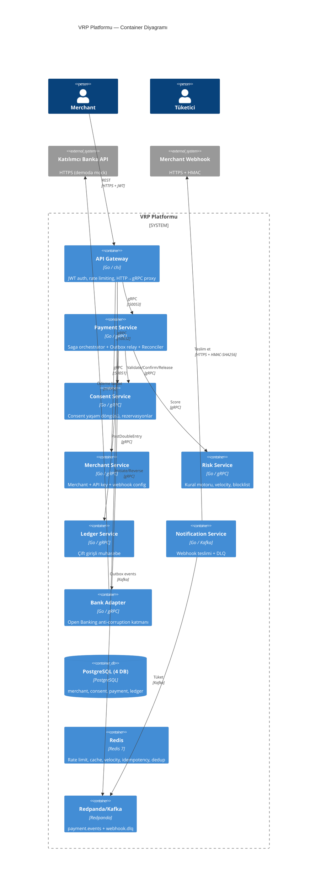
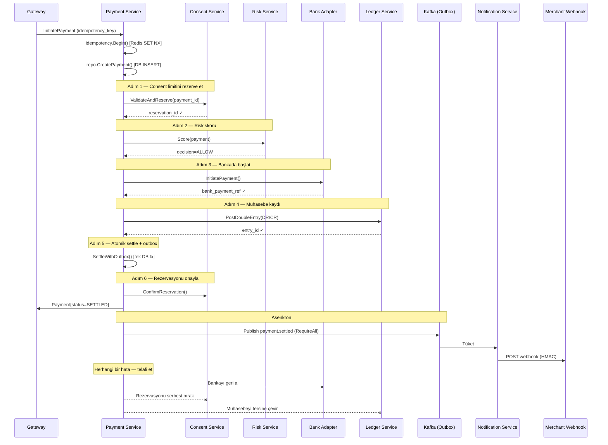

# Go ile Variable Recurring Payments (VRP): Tek Tıkla Pay-by-Bank Platformu İnşa Etmek

> İngiltere'nin VRP ekosistemine ve production-seviyesi bir Go mikroservis uygulamasına derin teknik bakış.
>
> **Kod:** [github.com/netologist/vrp-oneclick-deposit-platform](https://github.com/netologist/vrp-oneclick-deposit-platform)

---

## İçindekiler

1. [Problem: Neden Her Ödemede Yeniden Kimlik Doğrulaması?](#1-problem-neden-her-ödemede-yeniden-kimlik-doğrulaması)
2. [Variable Recurring Payment Nedir?](#2-variable-recurring-payment-nedir)
3. [Consent: Parametrelendirilmiş Bir Sözleşme](#3-consent-parametrelendirilmiş-bir-sözleşme)
4. [İngiltere VRP'ye Ne Zaman Geçti? Zaman Çizelgesi](#4-i̇ngiltere-vrpye-ne-zaman-geçti-zaman-çizelgesi)
5. [Sweeping vs Commercial VRP](#5-sweeping-vs-commercial-vrp)
6. [Finansal Altyapı İçin Neden Go?](#6-finansal-altyapı-i̇çin-neden-go)
7. [Mimari: 8 Servis, Tek Saga](#7-mimari-8-servis-tek-saga)
8. [Dağıtık Sistem Kalıpları Derinlemesine](#8-dağıtık-sistem-kalıpları-derinlemesine)
9. [Finansal Bütünlük: Çift Girişli Muhasebe](#9-finansal-bütünlük-çift-girişli-muhasebe)
10. [Lokalde Çalıştırma](#10-lokalde-çalıştırma)
11. [Production Sertleştirme ve Ölçekleme Yol Haritası](#11-production-sertleştirme-ve-ölçekleme-yol-haritası)
12. [Sonuç](#12-sonuç)

---

## 1. Problem: Neden Her Ödemede Yeniden Kimlik Doğrulaması?

Yıllar boyunca çevrimiçi ödemeler bir paradoks üzerine kuruluydu: **en ucuz ödeme altyapıları en az güvenilir, en güvenilirleri ise en pahalıydı.**

- **Card-on-file** — Hızlı ve tanıdık ama merchant kart numarasını saklar (PCI-DSS yükü), interchange ücretleri her işlemde %1–3 yer, kartların süresi dolar, çalınır veya yeniden basılır.
- **Direct Debit** — Ucuz ama yavaş (3–5 gün mutabakat), kaba taneli (değişken değil sabit tutar) ve kurulumu zahmetli. Geri almalar asimetrik: müşteri, ödeme "tamamlandı" dedikten çok sonra bile parayı geri çekebilir.
- **Standing order** — Sabit kira için iyi, değişken bir alışveriş sepeti için işe yaramaz.
- **Faster Payments (FPS)** — Neredeyse anlık, ama tarihsel olarak ödeyenin her transferi kendi bankacılık uygulamasında onaylamasını gerektirirdi.

Ortak nokta: **her bireysel ödeme yeni bir kimlik doğrulama turu gerektirir.** AB ve İngiltere'de bu doğrulama, PSD2 kapsamında **Strong Customer Authentication (SCA)** olarak yasal zorunluluktur — her "ödeme başlatma" için üç faktörden ikisi (bildiğin, sahip olduğun veya olduğun şey).

SCA ödemeleri güvenli yaptı. Aynı zamanda onları *yavaş ve sinir bozucu* hale getirdi. Her hafta hesabına £50 yatıran bir tüketici için her seferinde Face ID + OTP + banka uygulamasına yönlendirme yeniden girmek, doğrudan terk edilen işlemlere neden olan sürtünmedir.

**Variable Recurring Payments (VRP), bir kez kimlik doğrulayıp sonrasında önceden anlaşılmış limitler dahilinde bir *seri* ödemeyi — başka hiçbir etkileşim olmadan — yetkilendirmenizi sağlayan mekanizmadır.**

---

## 2. Variable Recurring Payment Nedir?

Bir **VRP**, **Payment Initiation Service Provider (PISP)**'ın — düzenlenmiş bir fintech veya merchant'ın — müşterinin banka hesabından **tekrar tekrar ve "değişken" şekilde** (tutar her seferinde farklı olabilir) ödeme çekmesine izin veren, her ödemenin müşterinin önceden kabul ettiği sınırlar içinde kalması koşuluyla tanınan uzun ömürlü bir yetkidir.

Bunu **korkuluklu bir standing order** gibi düşünün:

| Özellik | Standing Order | Direct Debit | **VRP** |
|---|---|---|---|
| Tutar | Sabit | Sabit veya değişken | **Değişken** (sınırlı) |
| Kurulum | Manuel, banka başına | Mandate formu | Open Banking consent |
| Kimlik doğrulama | Kurulumda bir kez | Yok (merchant çeker) | **Kurulumda bir kez SCA**, sonra yok |
| Hız | Banka toplu işlemi | 3–5 gün | **Yakın gerçek zamanlı (FPS)** |
| İptal edilebilir | Evet | Evet | **Evet, anında, PISP veya banka uygulamasından** |
| Limitler | Hayır | Hayır | **Evet — banka tarafından uygulanan sert limitler** |
| Mutabakat kesinliği | Yüksek | Yüksek | **Yüksek (banka kaynaklı push)** |

Kritik kelime **değişken**. Müşteri şunu yetkilendirir:

- *"Bu merchant, işlem başına £200'e, herhangi bir 30 günlük pencere içinde toplam £1.000'e kadar, önümüzdeki 12 ay boyunca hesabımdan para çekebilsin."*

Sonra merchant bugün £50, yarın £30, gelecek hafta £120 çekebilir — **bu sınırlar içinde herhangi bir tutar, herhangi bir sıklıkta** — ve her biri sıfır kullanıcı etkileşimiyle saniyeler içinde gerçekleşir.

Demo repo'nun uyguladığı "tek tıkla para yatırma" deneyimi budur.

---

## 3. Consent: Parametrelendirilmiş Bir Sözleşme

Bir VRP "sınırsız para hareketi" değildir. Müşteri, banka (Account Servicing Payment Service Provider, yani **ASPSP**) ve merchant (**PISP**) arasında **hassas, banka tarafından uygulanan bir sözleşmedir**.

Open Banking standardı şu **consent kontrol parametrelerini** tanımlar:

| Parametre | Anlam | Örnek |
|---|---|---|
| `MaximumAmount` | Tek ödeme için tavan | £200 |
| `PeriodicLimits` | Kayan pencere içinde tavan | £1.000 / 30 gün |
| `MaximumCumulativeNumber` | Pencere içinde maks. ödeme sayısı | 10 / 30 gün |
| `PeriodAlignment` | Pencerenin nasıl kaydığı | Takvim ayı vs kayan |
| `ValidFrom` / `ValidTo` | Consent ömrü | 1 yıl |
| `CreditorAccount` | Alacaklı — kilitli, değiştirilemez | Merchant'ın sort code + hesabı |

**Kritik özellik: bu limitleri *banka* uygular, merchant değil.** Bir PISP, bir limiti aşacak bir ödeme talimatı gönderdiğinde, ASPSP bunu *kaynağında* reddeder. Merchant, müşterinin kabul ettiğini sessizce aşamaz. Bu, merchant'ın teknik olarak açık bir çek tuttuğu Direct Debit'ten temelden farklıdır.

İki özellik daha önemlidir:

1. **Anında iptal.** Müşteri yetkiyi her an öldürebilir — PISP'nin uygulamasından *veya* doğrudan bankasının uygulamasından. Sonraki ödeme denemesi basitçe başarısız olur.
2. **Kimlik doğrulama öne alınır.** SCA *bir kez*, consent oluşturulurken gerçekleşir. Sonraki her ödeme SCA'yı tamamen atlar.

---

## 4. İngiltere VRP'ye Ne Zaman Geçti? Zaman Çizelgesi

İngiltere, VRP'nin küresel öncüsüdür ve geçişi iki farklı aşamada gerçekleşti — biri *zorunlu*, biri *gönüllü*.

### Aşama 0 — Düzenleyici Temel (2016–2018)

- **2016:** Competition and Markets Authority (CMA), Retail Banking Market Investigation Order'ı yayımladı; Birleşik Krallık'ın en büyük dokuz bankacılık grubunun (**CMA9**) müşteri verisi ve ödeme altyapısı üzerinde rekabeti bozan bir hakimiyeti olduğu sonucuna vardı.
- **2018:** CMA9'a, **Open Banking Implementation Entity (OBIE)** — sonradan **Open Banking Limited (OBL)** — aracılığıyla *Read/Write API* adlı bir **Open Banking API**'si uygulamaları emredildi.

**CMA9** şunlardır:

1. AIB Group (UK)
2. Bank of Ireland (UK)
3. Barclays
4. Danske Bank
5. HSBC Group (First Direct, M&S Bank dahil)
6. Lloyds Banking Group (Bank of Scotland, Halifax dahil)
7. Nationwide Building Society
8. NatWest Group (RBS, Ulster Bank NI dahil)
9. Santander UK

### Aşama 1 — Sweeping Zorunluluğu (2021–2024)

VRP, standarda ilk olarak **OBL Read/Write API v3.1.8** ile girdi, ancak CMA başlangıçtaki zorunluluğunu bilinçli olarak **"sweeping"** ile sınırladı — müşterinin *kendi hesapları arasında* para taşıma (ör. vadesiz hesaptan birikim hesabına otomatik aktarma).

- **Temmuz 2022:** CMA9'un VRP sweeping'i teslim etmesi için orijinal son tarih.
- **2022–2024:** OBL gözetiminde her bankanın canlıya geçtiği kademeli bir *Managed Roll Out (MRO)*.
- **Eylül 2024:** Zorunluluk **tamamen tamamlandı** ilan edildi — son iki banka, Allied Irish Bank ve Bank of Ireland, MRO'dan çıktı. Tüm CMA9 bankaları artık VRP sweeping sunuyor.

### Aşama 2 — Commercial VRP (2026–günümüz)

Sweeping yalnızca ilk adımdı. Asıl ekonomik devrim **Commercial VRP (cVRP)** — işletmelere yapılan ödemeler (faturalar, abonelikler, e-ticaret ve bu repo'nun gösterdiği "tek tıkla para yatırma"). Sweeping'in aksine, cVRP katılımı bankalar için **gönüllüdür**.

- **Şubat 2026:** **UK Payments Forward Plan**, VRP'yi Birleşik Krallık ödeme geleceğinin temel direği ilan etti.
- **2 Haziran 2026:** Commercial VRP, **31 firma** tarafından kurulan bağımsız kuruluş **UK Payments Initiative (UKPI)** altında canlıya geçti; tek bir kural seti ve ticari model sağladı.

---

## 5. Sweeping vs Commercial VRP

| Özellik | Sweeping VRP ("me-to-me") | Commercial VRP (cVRP) |
|---|---|---|
| **Durum** | Zorunlu, tamamen uygulandı | Gönüllü, Haziran 2026'dan beri canlı |
| **Amaç** | Kendi hesaplar arasında para taşıma | İşletmelere/merchant'lara ödeme |
| **Yönetişim** | CMA Order (OBL izler) | UK Payments Initiative (UKPI) |
| **Ticari model** | Ücretsiz (zorunlu) | Sektör standardı, müzakere edilir |
| **Dolandırıcılık riski** | Düşük (ödeyen = alacaklı) | Yüksek (üçüncü taraf alacaklı) |
| **Kullanım alanları** | Birikim hesapları, overdraft | Abonelikler, para yatırma, faturalar |

---

## 6. Finansal Altyapı İçin Neden Go?

Go, finansal işlem sistemleri için biçilmiş kaftandır:

- **Goroutine + channel** — hafiftir; tek bir servis on binlerce eşzamanlı saga'yı düşük bellek yüküyle yönetir.
- **Statik tip güvenliği** — derleyici tüm protobuf/gRPC uyuşmazlıklarını derleme zamanında yakalar.
- **`context.Context`** — deadline, cancellation ve W3C traceparent yayılımı için dile gömülü dağıtık izleme.
- **Zor kısımlar için stdlib** — `net/http`, `crypto/hmac`, `crypto/subtle`, `encoding/json`, `log/slog`.
- **Statik binary + distroless container** — `gcr.io/distroless/static-debian12:nonroot` ile shellsiz, güvenli container imajları.

---

## 7. Mimari: 8 Servis, Tek Saga

Repo, **sekiz mikroservis**, üretilmiş bir protobuf modülü (`gen/`) ve paylaşılan bir kütüphane (`pkg/shared/`) içeren bir Go workspace'idir (`go.work`).



### Altı Adımlı Ödeme Saga'sı

```
Consent → Risk → Banka → Ledger → Settle+Outbox → Confirm
```



---

## 8. Dağıtık Sistem Kalıpları Derinlemesine

### 8.1 Transactional Outbox (`FOR UPDATE SKIP LOCKED`)

Durum değişikliği ile Kafka event kaydı tek bir veritabanı transaction'ında atomik yazılır. Outbox relay, çoklu replikalarda mükerrerliği önlemek için `FOR UPDATE SKIP LOCKED` ile satırları kilitler:

```go
// payment-svc/internal/repo.go — ListOutbox
func (r *Repo) ListOutbox(ctx context.Context, limit int) ([]OutboxRow, error) {
    const q = `
SELECT id, topic, key, payload, created_at
FROM outbox
ORDER BY created_at ASC
LIMIT $1
FOR UPDATE SKIP LOCKED`
    // ...
}
```

### 8.2 In-Flight Crash Recovery (Reconciliation Worker)

Pod ödemenin ortasında çöktüğünde (ör. bankadan para çekilmiş ama ledger yazılmadan önce), bellekteki saga durumu uçar. `ReconciliationWorker` askıda kalan ödemeleri tarar, banka durumunu sorgular ve işlemi otomatik tamamlar veya telafi eder:

```go
// payment-svc/internal/reconciliation.go
func (w *ReconciliationWorker) reconcileStalePayments(ctx context.Context) {
    stale, _ := w.repo.ListStaleInFlightPayments(ctx, w.staleAfter)
    for _, p := range stale {
        if p.BankPaymentRef != "" {
            resp, _ := w.bank.GetPaymentStatus(ctx, &bankv1.StatusRequest{BankPaymentRef: p.BankPaymentRef})
            if resp.GetStatus() == bankv1.BankPaymentStatus_SETTLED {
                _ = w.orchestrator.ResumeFromLedger(ctx, p) // 4. adımdan devam et
                continue
            }
        }
        _ = w.orchestrator.CompensateStale(ctx, p, "RECONCILIATION_TIMEOUT")
    }
}
```

### 8.3 Zero-Alloc Webhook HMAC & Replay Koruması

Webhook imzalamada bellek allokasyonunu sıfırlamak için stack buffer kullanılır; replay saldırılarına karşı 5 dakikalık tazelik kontrolü uygulanır:

```go
// pkg/shared/webhook/hmac.go
func VerifyWithTolerance(secret, signature string, timestamp time.Time, body []byte, maxAge time.Duration) bool {
    if maxAge > 0 {
        age := time.Since(timestamp)
        if age < 0 { age = -age }
        if age > maxAge {
            return false // Replay saldırısı engellendi
        }
    }
    expected := Sign(secret, timestamp, body)
    return hmac.Equal([]byte(expected), []byte(signature))
}
```

### 8.4 Atomik Redis Rate Limiting (Lua Script)

Gateway katmanında yarış durumlarını (race condition) engellemek için tek bir Redis turunda çalışan atomik Lua scripti kullanılır:

```lua
local key = KEYS[1]
local limit = tonumber(ARGV[1])
local current = redis.call('INCR', key)
if current == 1 then
    redis.call('EXPIRE', key, 2)
end
return current
```

### 8.5 `google.rpc.ErrorInfo` ile Yapılandırılmış Hata Yönetimi

Kırılgan string parsing (`strings.Contains`) yerine gRPC sınırlarında domain kodları `ErrorInfo` detayında taşınır:

```go
// pkg/shared/domainerr/errors.go
st := status.New(codes.FailedPrecondition, de.Message)
stWithDetails, _ := st.WithDetails(&errdetails.ErrorInfo{
    Reason: string(de.Code),
    Domain: DomainPlatform,
})
```

---

## 9. Finansal Bütünlük: Çift Girişli Muhasebe

Bir ödeme ledger'ı **kanıtlanabilir şekilde dengeli** olmalıdır ($\sum \text{Borç} = \sum \text{Alacak}$).

`ledger-svc` bunu veritabanı seviyesinde `CONSTRAINT TRIGGER` ile doğrular:

```sql
-- migrations/ledger/000001_init.up.sql
CREATE CONSTRAINT TRIGGER trg_journal_balance
AFTER INSERT OR UPDATE ON journal_line
DEFERRABLE INITIALLY DEFERRED
FOR EACH ROW
EXECUTE FUNCTION check_journal_balance();
```

**`Money` value object'i** (`pkg/shared/money`) kuruş bazında tamsayı (`int64`) tutar ve para birimi uyuşmazlığı kontrolü yapar:

```go
type Money struct {
    AmountPence int64
    Currency    string // ISO 4217 büyük harf doğrulamalı
}

func (m Money) Add(other Money) (Money, error) {
    if !m.SameCurrency(other) {
        return Money{}, fmt.Errorf("cannot add %s to %s: currency mismatch", other.Currency, m.Currency)
    }
    return Money{AmountPence: m.AmountPence + other.AmountPence, Currency: m.Currency}, nil
}
```

---

## 10. Lokalde Çalıştırma

```bash
# 1) Altyapı — Postgres, Redis, Redpanda (Kafka), Jaeger, Prometheus, Grafana
make up

# 2) 8 mikroservisi ./bin'e derle
make build

# 3) Tüm servisleri arka planda başlat
./scripts/run-all.sh

# 4) Uçtan uca smoke testi çalıştır
./scripts/e2e-smoke.sh
```

| Servis | Port | Açıklama |
|---|---|---|
| Gateway (HTTP) | 8080 | REST API & Swagger UI (`/docs`) |
| Merchant gRPC | 50051 | Kayıt & API anahtarları |
| Consent gRPC | 50052 | Rıza limitleri & rezervasyonlar |
| Payment gRPC | 50053 | Saga orchestrator |
| Risk gRPC | 50054 | Gerçek zamanlı fraud kontrolü |
| Ledger gRPC | 50055 | Çift girişli muhasebe |
| Bank Adapter gRPC | 50056 | Open Banking adapter & mock |

---

## 11. Production Sertleştirme ve Ölçekleme Yol Haritası

Platform 4 haftalık üretim sertleştirme programını tamamlamıştır. Kalan hedefler Tier-1 kurumsal ölçeklemeye odaklanmaktadır:

| Alan | Mevcut Durum (Sertleştirilmiş) | Day-2 Ölçekleme Hedefi |
|---|---|---|
| **Outbox Relay** | `FOR UPDATE SKIP LOCKED` + `RequireAll` | **Debezium CDC** (Postgres WAL streaming) |
| **Saga Dayanıklılığı** | `ReconciliationWorker` (Crash recovery) | **Temporal / Cadence** iş akışı motoru |
| **Güvenlik** | Distroless nonroot `securityContext`, Replay koruması | **Istio / Linkerd mTLS Service Mesh** |
| **Veritabanı HA** | Çoklu veritabanı şema izolasyonu | **CloudNativePG HA StatefulSets** + read-replica |
| **Gözlemlenebilirlik** | Context `TraceHandler`, W3C traceparent | **OpenTelemetry Collector & RED Prometheus metrikleri** |

---

## 12. Sonuç

Variable Recurring Payments, Faster Payments'tan bu yana Birleşik Krallık ödeme altyapısındaki en önemli yeniliktir: **bir kez kimlik doğrula, birçok kez öde, sert ve banka tarafından uygulanan limitlerle.**

[vrp-oneclick-deposit-platform](https://github.com/netologist/vrp-oneclick-deposit-platform) repo'su, sagalar, transactional outbox'lar, kaza mutabakatı (crash reconciliation) ve çift girişli muhasebe defterlerini Go dilinin zarafetiyle bir araya getiren üretime hazır bir referans mimarisidir.

---

*Bu yazı, açık kaynaklı [github.com/netologist/vrp-oneclick-deposit-platform](https://github.com/netologist/vrp-oneclick-deposit-platform) projesine atıfta bulunur. VRP düzenleyici gerçekleri CMA/OBL/UKPI kaynaklarına göre doğrulanmıştır; 2026 itibarıyla günceldir.*
