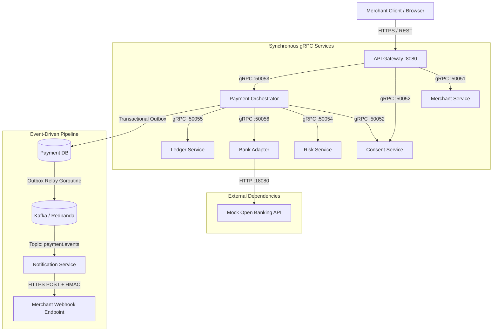

# System Architecture & Service Breakdown

The VRP platform is structured as an **Orchestrated Microservices Architecture**. High-performance synchronous calls between internal services utilize **gRPC over HTTP/2**, while asynchronous notifications use **Apache Kafka (Redpanda)**.

---

## High-Level Topology

---

## Microservice Responsibilities

### 1. API Gateway (`cmd/gateway`, `:8080`)
- **Protocol**: External REST / JSON $\rightarrow$ Internal gRPC.
- **Security**: JWT Bearer token authentication middleware; public routes for merchant registration & token exchange.
- **Resilience**: Redis token-bucket rate limiting per merchant ID.
- **Documentation**: Embedded Swagger UI served live at `/docs`.

### 2. Merchant Service (`services/merchant-svc`, `:50051`)
- **Domain**: Merchant registration, API Key management, KYB approval status.
- **Security**: Plaintext API Keys are generated with prefix (`vrp_<32-hex>`), shown once, and persisted as bcrypt hashes ($O(1)$ prefix lookup).
- **Webhook Config**: Exposes HMAC signing secrets for the Notification Service.

### 3. Consent Service (`services/consent-svc`, `:50052`)
- **Domain**: VRP Consent lifecycle (`PENDING` $\rightarrow$ `ACTIVE` $\rightarrow$ `REVOKED` / `EXPIRED`).
- **Limit Enforcement**: Manages rolling 30-day window limits using pessimistic database locks (`SELECT FOR UPDATE`).
- **Reservation Lifecycle**: Handles `ValidateAndReserve`, `ConfirmReservation`, and `ReleaseReservation`.
- **Caching**: Hot reads cached in Redis (5-minute TTL) with automatic invalidation on status changes.

### 4. Payment Orchestrator (`services/payment-svc`, `:50053`)
- **Domain**: Owns the payment state machine and controls the **5-step Orchestration Saga**.
- **Idempotency**: Distributed lock using Redis (`SET NX EX 24h`) before initiating payment mutations.
- **Outbox Relay**: Writes `payment.settled` events inside the same PostgreSQL transaction as payment status updates to guarantee at-least-once Kafka publishing.

### 5. Risk Service (`services/risk-svc`, `:50054`)
- **Domain**: Real-time fraud scoring ($< 50\text{ms}$ target).
- **Rules Engine**:
  1. **Blocklist Rule**: Checks Redis sets for blocklisted consumers, merchants, or IP addresses ($\rightarrow$ `DECLINE`).
  2. **Velocity Rule**: Tracks transaction count in 60-second windows using Redis atomic counters ($\rightarrow$ `REVIEW` if $>5$).
  3. **High-Value Rule**: Flags transactions exceeding £500 ($\rightarrow$ `REVIEW`).

### 6. Ledger Service (`services/ledger-svc`, `:50055`)
- **Domain**: Double-entry financial accounting.
- **Accounts**: `CONSUMER_ESCROW`, `MERCHANT_ESCROW`, `PLATFORM_FEE`.
- **Invariants**: Strict double-entry balance enforced by database constraint triggers ($\sum \text{Debits} = \sum \text{Credits}$).
- **Isolation**: Uses `Serializable` isolation to prevent write skew or phantom reads.

### 7. Bank Adapter (`services/bank-adapter`, `:50056`)
- **Domain**: Anti-Corruption Layer (ACL) abstracting Open Banking UK APIs.
- **Resilience**:
  - `sony/gobreaker` circuit breaker (trips after 10 consecutive failures).
  - `avast/retry-go` exponential backoff (3 attempts, 100ms base).
- **Mock Bank**: Includes built-in HTTP server simulating Fast Payments Service (FPS) latency and configurable failure rates.

### 8. Notification Service (`services/notification-svc`)
- **Domain**: Asynchronous webhook delivery worker.
- **Security**: Computes HMAC-SHA256 signatures (`X-PC-Signature`) using merchant secret.
- **Retries & DLQ**: Delivers with exponential backoff (1s, 2s, 4s). Publishes to `webhook.dlq` after 3 failed attempts.

---

## Communication Matrix

| Source | Destination | Protocol | Purpose |
|--------|-------------|----------|---------|
| Gateway | Merchant Service | gRPC | API Key authentication & Merchant details |
| Gateway | Consent Service | gRPC | Create & manage VRP Consents |
| Gateway | Payment Orchestrator | gRPC | Initiate payment & query status |
| Payment Orchestrator | Consent Service | gRPC | Validate & reserve limits |
| Payment Orchestrator | Risk Service | gRPC | Fraud scoring |
| Payment Orchestrator | Bank Adapter | gRPC | Initiate Fast Payments transfer |
| Payment Orchestrator | Ledger Service | gRPC | Post double-entry journal lines |
| Bank Adapter | Mock Bank API | HTTP | Fast Payments network request |
| Outbox Relay | Kafka | TCP | Publish `payment.events` |
| Notification Service | Kafka | TCP | Consume `payment.events` |
| Notification Service | Merchant Webhook | HTTPS | Deliver webhook payload |
