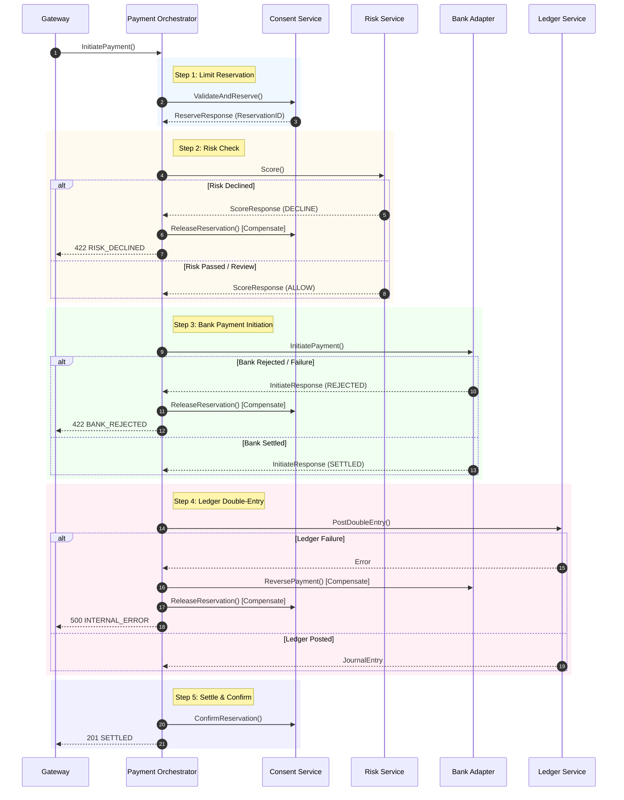

# System Design & Microservices Patterns

This document details the core software architecture patterns implemented in the VRP platform.

---

## 1. Saga Orchestration Pattern with Compensating Actions

Distributed transactions across microservices cannot rely on 2PC (Two-Phase Commit) due to latency and availability locks. We implement an **Orchestrated Saga** managed by the Payment Orchestrator.



### Fallback Guarantee (Manual Review)
If a compensating step fails during rollback (e.g. `ReleaseReservation` fails due to network partition), the payment status moves to `MANUAL_REVIEW`, triggering an operator alert.

---

## 2. Transactional Outbox Pattern

To prevent dual-write inconsistencies (updating the payment database successfully, but failing to publish to Kafka), the Payment Orchestrator uses a **Transactional Outbox**:

```sql
BEGIN;
  UPDATE payment 
  SET status = 'SETTLED', settled_at = NOW(), bank_payment_ref = $1 
  WHERE id = $2;

  INSERT INTO outbox (id, topic, key, payload) 
  VALUES (gen_random_uuid(), 'payment.events', $2, $payload_json);
COMMIT;
```

A background relay goroutine in `payment-svc` polls the `outbox` table every 200ms, publishes the payload to Kafka via `segmentio/kafka-go`, and deletes the row upon receipt of broker acknowledgment. This ensures **at-least-once delivery**.

---

## 3. Pessimistic Lock Reservation Pattern for Limits

To prevent concurrent payment requests from exceeding a consent's monthly spending limit (race condition / overspend risk), the Consent Service executes a **pessimistic lock**:

```sql
BEGIN;
  -- Lock the consent row to serialize concurrent reservations on the same consent
  SELECT max_monthly_pence FROM consent WHERE id = $1 AND status = 'ACTIVE' FOR UPDATE;

  -- Sum settled transactions in the rolling 30-day window plus active reservations
  SELECT COALESCE(SUM(amount_pence), 0) FROM consent_usage 
  WHERE consent_id = $1 AND settled_at > NOW() - INTERVAL '30 days';

  -- Verify limit and insert reservation with HELD status & 10-minute expiry
  INSERT INTO consent_reservation (id, consent_id, payment_id, amount_pence, status, expires_at)
  VALUES (gen_random_uuid(), $1, $2, $3, 'HELD', NOW() + INTERVAL '10 minutes');
COMMIT;
```

---

## 4. Double-Entry Accounting Invariant

The Ledger Service requires that every transaction balances perfectly ($\text{Debits} = \text{Credits}$). A standard settlement entry contains 3 lines:
- **Debit (DR)**: Consumer Escrow Account (£50.00)
- **Credit (CR)**: Merchant Escrow Account (£49.50)
- **Credit (CR)**: Platform Fee Account (£0.50 — 1% fee)

To guarantee financial integrity at the database layer, a PostgreSQL **Constraint Trigger** checks for zero imbalance when the transaction commits:

```sql
CREATE OR REPLACE FUNCTION check_journal_balance() RETURNS TRIGGER AS $$
DECLARE
    imbalance BIGINT;
BEGIN
    SELECT COALESCE(SUM(CASE WHEN direction = 'DR' THEN amount_pence ELSE -amount_pence END), 0)
    INTO imbalance
    FROM journal_line WHERE journal_entry_id = NEW.journal_entry_id;

    IF imbalance != 0 THEN
        RAISE EXCEPTION 'Journal entry % is unbalanced by % pence', NEW.journal_entry_id, imbalance;
    END IF;
    RETURN NEW;
END;
$$ LANGUAGE plpgsql;

CREATE CONSTRAINT TRIGGER trg_journal_balance
    AFTER INSERT ON journal_line
    DEFERRABLE INITIALLY DEFERRED
    FOR EACH ROW EXECUTE FUNCTION check_journal_balance();
```

---

## 5. Distributed Idempotency via Redis

Every payment request MUST carry an `Idempotency-Key` header.
Before initiating any database mutations, the Payment Orchestrator attempts an atomic `SET NX EX 24h` in Redis:

1. **First Request**: `SET NX` succeeds $\rightarrow$ key state set to `PROCESSING`. Saga begins.
2. **Concurrent Request**: `SET NX` returns false $\rightarrow$ caller polls Redis for up to 5 seconds. Once the key state transitions to a payment UUID, the existing result is fetched from PostgreSQL and returned without executing a duplicate charge.
3. **Completed Request**: Key holds the completed payment ID $\rightarrow$ immediate cached response.
